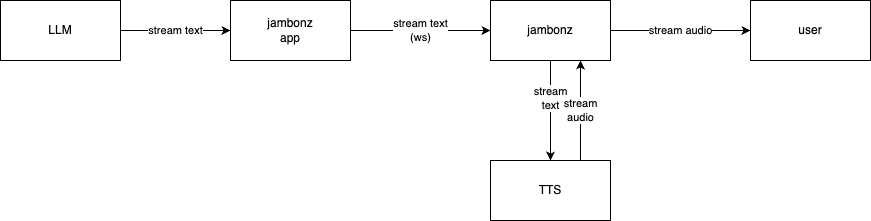

# What is LLM Streaming?

In the world of Voice AI, providing a responsive, low-latency conversational experience is the holy grail. One technique that is used to minimize latency is end-to-end streaming of text and/or audio to the user. With jambonz you can build Voice AI applications that leverage LLM streaming and the basic architecture looks like this:

<Frame caption="jambonz streaming pipeline">
  
</Frame>


In this article we will do a deep dive on the jambonz streaming architecture and show you how to build an example Voice AI streaming application.

# jambonz streaming architecture
## Prerequisites
Support for LLM and TTS streaming in jambonz has been greatly improved and simplified in jambonz release 0.9.3, so this article assumes that you are running that release or later.  

In order to take advantage of the streaming feature you also need to build your jambonz application using the websocket API.  (The example code we will show in this article use our Node.js SDK which provides an easy way to implement streaming in your application).

Finally, as of release 0.9.3 we support the following TTS vendors for streaming:  

- Deepgram
- Elevenlabs
- Cartesia
- Rimelabs

We are adding additional vendors all the time, so check back with us if you are looking for support from a different vendor.

## jambonz websocket protocol for streaming

The full websocket api is described here, but in this article we will focus on the streaming commands.

A jambonz application initiates a streaming request during a call session by sending a [tts:tokens]() message to jambonz.  Typically, as your application receives streaming text tokens from an LLM it simply sends them immediately on to jambonz using a message like this:

```json
{
      "type": "command",
      "command": "tts:tokens",
      "queueCommand": false,
      "data": {
            "id": 101,
            "tokens": "It was the best of times, it was the "
      }
    }
}
```

Let's go through this in detail.

The websocket api always has used the "command" type to send instructions to jambonz, so that part is not new.  The specific command "tts:tokens" is new, and this is how your application sends a chunk of text to jambonz as part of a larger stream of text it is receiving.  

There are two parameters, both required:

- **id**: this can be either a number or a string, as you like.  It must be unique within this session and, as we will see shortly, it is used by jambonz to send you a confirmation that your tokens have been accepted.
- **tokens**: this is a string of text that appears within a larger text stream you are receiving from the LLM

This is simple enough, but instantly several questions may come to your mind:

1. Are text tokens always accepted?  What if I send them before the jambonz application is ready to play them out?
2. Is there any rate limiting?  What if I overload the server?  In fact, what if a malicious client deliberately tries to overload the server?
3.  Do I need to explicitly tell jambonz when to generate audio from the tokens while streaming?

Let's answer those questions.

### FAQs
#### How do I know if my tts:tokens command was accepted?
For each tts:tokens request you send to jambonz you will get an acknowledgement in the form of a tts:tokens-result:

```json
{
    "type": "tts:tokens-result",
     "data": {
            "id": 101,
            "status": "ok"
     }
}
```
The message will have an "id" and a "status" property.  The status property will be either "ok", or "failed";  if "failed" then an additional "reason" property shall be included to indicate why the request failed.  The following reasons can occur:

- "missing tokens": no tokens were provided in the request
- "full": the application has sent too many tokens and must temporarily buffer and resend later
- "connection to {vendor} failed": an error was encountered attempting to connect to the TTS vendor

We will spend more time on how to handle failures where the reason = "full" below.

#### What if I send tokens before jambonz is ready to play them?

You may wonder what do we mean by "when jambonz is ready to play them"?  

When we look at a sample application later this will be more easily explained, but in general for now we can say that when an incoming call arrives on SIP trunk, say, and jambonz begins handling it, it is possible for your application to response with streaming text even before the audio connection has been fully established.  

For this and other cases, jambonz will simply queue the text tokens and then process them as soon as the stream is open from jambonz to the TTS vendor.  So you can send tokens at any time and not worry particularly about whether the TTS connection is currently open or not.

#### Do I need to tell jambonz when to generate audio?

Yes, you should send a tts:flush command periodically to jambonz to cause it to tell the TTS engine to generate and flush audio.  

```json
{
      "type": "command",
      "command": "tts:flush",
      "queueCommand": false
    }
}
```

Most LLMs have a streaming protocol that make it pretty simple to know when to flush the audio, for instance using the Anthropic API you would do so whenever getting a "message_stop" event:

```js
    for await (const messageStreamEvent of stream) {
      if (messageStreamEvent.delta?.text) {
        const tokens = messageStreamEvent.delta.text;
        session.sendTtsTokens(tokens);
      }
      else if (messageStreamEvent.type === 'message_stop') {
        session.flushTtsTokens();
      }
    }
```
Note: we are using the @jambonz/node-client-ws sdk in the above example code to send the `tts:tokens` and `tts:flush` messages.

#### Is there any rate limiting?

Yes, jambonz will only buffer about 5,000 characters for you.  If you send more than that jambonz will return a tts:tokens-result message with a status of "failed" and a reason of "full".  It is your responsibility to stop sending until jambonz sends you an event indicating that the stream is open for sending again.

Note: if you use the @jambonz/node-client-ws sdk, this buffering is handled for you.  You will not need to implement any buffering code in your application.  if you write your code directly to the low-level websocket interface though, you need to take this into consideration.

Now, in the context of understanding the event that jambonz will send you once it is ready to accept tokens again after a "full" condition is encountered, let's look at all of the tts-related events that jambonz sends your application.

### tts-related events sent by jambonz

jambonz will send your application the following events over the websocket:

- **stream_open**: this event is sent any time jambonz begins actively streaming text to the TTS vendor.  As we shall see when we look at the example application code, this has to do with how and where you use the `say` verb with the `streaming` property in your application.  As noted above, your application can send text tokens in advance of this event and, in the general case, there is no specific action required for your application to take when this event is generated.
- **stream_closed**: this event is sent when jambonz is not actively streaming text to the TTS vendor.  You can continue sending tokens to jambonz however, and they will be buffered and then sent when the next "stream_open" event occurs.
- **stream_paused**: this event event is sent when jambonz has buffered the max amount of text that it will accept from your application.  You should reframe from sending any more text until you get a "stream_resumed" event.
- **stream_resumed**: this event is sent when the text buffer maintained by jambonz has drained to an extent that you can again begin sending text.
- **user_interruption**: this event is sent when the user has "barged in", i.e. starting speaking during audio playout from the TTS engine.

If you use the Node.js sdk you do not necessarily need to respond to any of these events.  If you are writing to the low-level websocket api then minimally you should have a handler for the "stream_resumed" handler because you would need to handle throttling in your application.

## jambonz verb support for streaming

If you have previously used jambonz, you are aware that text to speech is usually triggered via the [say]() verb. 

```js
session
    .say({text: 'Hi there, how can I help you today.'})
```
There are two simple changes in release 0.9.3 of jambonz to support streaming.  The first is that the `say` verb can be used with a `streaming` property instead of `text`.

### say verb with streaming

```js
session
    .say({streaming: true})
```
The "streaming" property is mutually exclusive with the "text" property; you must specify one or the other.

When a `say` verb with `streaming` is executed, jambonz connects to the streaming TTS engine, sends a `stream_open` event and begins streaming text to the TTS engine.  Any buffered text that was received from your application prior to this will be sent at this time.

If the `say` verb is nested within a gather, e.g.

```js
session
   .gather({
       say({streaming: true})
       input: ['speech']
```

Then when the `gather` ends the `say` verb is killed.  At that point jambonz will send a `stream_closed` event to your application.  Any text received from this point will be buffered by jambonz and sent when the next say with streaming is executed.

This is useful, but another alternative is to use a "background say with streaming".

### background say with streaming

If you have used jambonz you might be familiar with the concept of a "background gather" where your application can essentially always be listening and returning you transcripts while a user speaks.  This can be useful when creating voice bot platforms.

Similarly, in 0.9.3 you can create a "background say" with streaming by using the [config]() verb.

```js
      session
        .config({
          ttsStream: {
            enable: true,
          },
          bargeIn: {
            enable: true,
            sticky: true,
            minBargeinWordCount: 1,
            actionHook: '/speech-detected',
            input: ['speech']
          }
        })
        .say({text: 'Hi there, how can I help you today?'})
        .send();
```
In the example above the `ttsStream` is used to enable a `say` verb with streaming that is operating in the background.  Any text that your application streams to jambonz will be immediately played out.

If you want to disable streaming at some point in your application you simply issue another `config` verb:

```js
session
   .config({
      ttsStream: {
         enable: false
      }
  })
```

# jambonz sdk support for streaming

If you've used the [jambonz Node.js sdk for websocket api](https://www.npmjs.com/package/@jambonz/node-client-ws) you are used to using the `Session` class, as in this code snippet:

```js
const service = ({logger, makeService}) => {
  const svc = makeService({path: '/tts-streaming'});

  svc.on('session:new', (session) => {
    logger.debug({session}, `new incoming call: ${session.call_sid}`); 
```

Several new methods and events have been added to the Session class to support streaming.

## Streaming-related methods

- **sendTtsTokens(text)**: sends text tokens to jambonz.  This method will handle flow control with jambonz if necessary.
- **flushTtsTokens()**: notifies jambonz that the audio provided should be flushed through the TTS engine.
- **clearTtsTokens()**: clears all buffered and pending audio; typically called to handle a user interruption.

## Streaming-related events

- **tts:streaming-event**: sent by jambonz to notify the application of a streaming-related event.  

As above, event types that can be sent are `stream_open`, `stream_closed`, `stream_paused`, `stream_resumed`

- **tts:user_interrupt**: sent by jambonz to notify the application that the user has barged into the audio playback.  The application should stop sending text tokens at this point and wait for the next utterance from the user.

# Example application using streaming

Let's look at a sample Voice AI application that uses Anthropic to provide a conversational interface with a user.

This sample application can be generated using the `npx create-jambonz-ws-app`.  If you have not used this before, it is a simple command line utility that can scaffold up different types of jambonz applications, using the websocket api

```bash
 npx create-jambonz-ws-app
Usage: create-jambonz-ws-app [options] project-name

Options:
  -v, --version              display the current version
  -s, --scenario <scenario>  generates a sample websocket app for jambonz (default: "hello-world")
  -h, --help                 display help for command


Scenarios available:
- hello-world: a simple app that responds to an incoming call using text-to-speech
- echo: an collect-and-response app that echos caller voice input
- openai-realtime: a conversational voice interface to the OpenAI Realtime API
- deepgram-voice-agent: a conversational voice interface to the Deepgram Voice Agent API
- llm-streaming: example of streaming text tokens from Anthropic LLM
- all: generate all of the above scenarios

Example:
  $ npx create-jambonz-ws-app --scenario "hello-world, echo" my-app
```

To generate an LLM streaming application using Anthropic as the LLM is as simple as this:

```bash
$ npx create-jambonz-ws-app --scenario llm-streaming my-app

Creating a new jambonz websocket app in /Users/dhorton/Downloads/my-app

Installing packages...
$
```
The main part of the application is just over 100 lines of code.

```js maxLines=120
const Anthropic = require('@anthropic-ai/sdk');
const assert = require('assert');
const ANTHROPIC_MODEL = 'claude-3-5-haiku-latest';
const systemPrompt = `You are a helpful conversational AI voice bot.
Please keep your answers short and to the point; the user will follow up with more questions if needed.
Please reply with unadorned text that can be read aloud to the user using a TTS engine`;

assert(process.env.ANTHROPIC_API_KEY, 'ANTHROPIC_API_KEY is required');

const service = ({logger, makeService}) => {
  const svc = makeService({path: '/llm-streaming'});

  svc.on('session:new', (session) => {

    session.locals = {
      logger: logger.child({call_sid: session.call_sid}),
      client: new Anthropic({ system: systemPrompt }),
      messages: [],
      assistantResponse: ''
    };
    logger.debug({session}, `new incoming call: ${session.call_sid}`);


    session
      .on('/speech-detected', onSpeechDetected.bind(null, session))
      .on('tts:streaming-event', onStreamingEvent.bind(null, session))
      .on('tts:user_interrupt', onUserInterrupt.bind(null, session))
      .on('close', onClose.bind(null, session))
      .on('error', onError.bind(null, session));

    try {
      session
        .config({
          ttsStream: {
            enable: true,
          },
          bargeIn: {
            enable: true,
            sticky: true,
            minBargeinWordCount: 1,
            actionHook: '/speech-detected',
            input: ['speech']
          }
        })
        .say({text: 'Hi there, how can I help you today?'})
        .send();
    } catch (err) {
      session.locals.logger.info({err}, `Error to responding to incoming call: ${session.call_sid}`);
      session.close();
    }
  });
};

const onSpeechDetected = async(session, event) => {
  const {logger, client} = session.locals;
  const {speech} = event;

  session.reply();

  if (speech?.is_final) {
    const {transcript} = speech.alternatives[0];
    session.locals.messages.push({
      role: 'user',
      content: transcript
    });
    session.locals.user_interrupt = false;

    logger.info({messages:session.locals.messages}, `session ${session.call_sid} making request to Anthropic`);

    const stream = await client.messages.create({
      model: ANTHROPIC_MODEL,
      max_tokens: 1024,
      messages: session.locals.messages,
      stream: true
    });

    for await (const messageStreamEvent of stream) {
      if (session.locals.user_interrupt) {
        logger.info(`session ${session.call_sid} user interrupted, closing stream`);
        session.locals.messages.push({
          role: 'assistant',
          content: `${session.locals.assistantResponse}...`
        });
        session.locals.assistantResponse = '';
        break;
      }

      logger.info({messageStreamEvent}, `session ${session.call_sid} received message stream event`);

      if (messageStreamEvent.delta?.text) {
        const tokens = messageStreamEvent.delta.text;
        session.locals.assistantResponse += tokens;
        session.sendTtsTokens(tokens)
          .catch((err) => logger.error({err}, 'error sending TTS tokens'));
      }
      else if (messageStreamEvent.type === 'message_stop') {
        logger.info(`session ${session.call_sid} flushing TTS tokens`);
        session.flushTtsTokens();
        session.locals.messages.push({
          role: 'assistant',
          content: session.locals.assistantResponse
        });
        session.locals.assistantResponse = '';
      }
    }
    logger.info(`session ${session.call_sid} completed processing stream`);
  }
};

const onUserInterrupt = (session) => {
  const {logger} = session.locals;
  logger.info(`session ${session.call_sid} received user interrupt, cancel any requests in progress to Anthropic`);
  session.locals.user_interrupt = true;
};

const onStreamingEvent = (session, event) => {
  const {logger} = session.locals;
  logger.info({event}, `session ${session.call_sid} received streaming event`);
};

const onClose = (session, code, reason) => {
  const {logger} = session.locals;
  logger.debug({session, code, reason}, `session ${session.call_sid} closed`);
};

const onError = (session, err) => {
  const {logger} = session.locals;
  logger.info({err}, `session ${session.call_sid} received error`);
};

module.exports = service;
```
You can see it's pretty simple: we use a "background gather" (config.bargeIn) always be collecting the user's utterance, and a "background say" (config.ttsStream) to stream text from the LLM vendor via jambonz to the TTS Engine.

We have event handlers to receive streaming events from jambonz, and we handle user interruptions by canceling the outstanding request to Anthropic.  

That's it!  Feel to modify to your needs.


