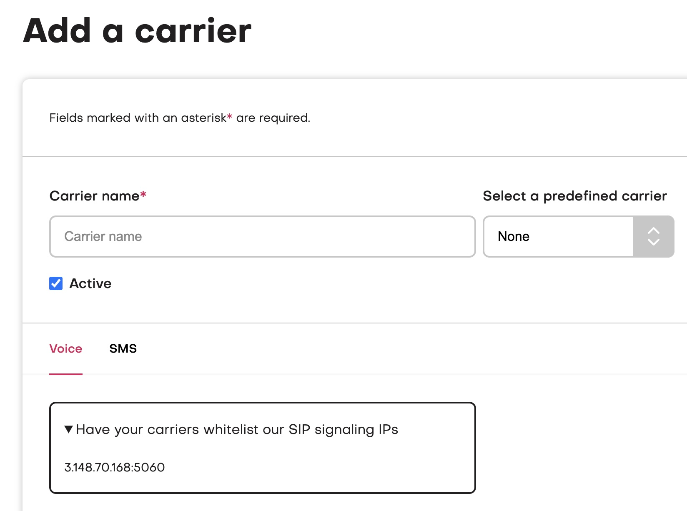
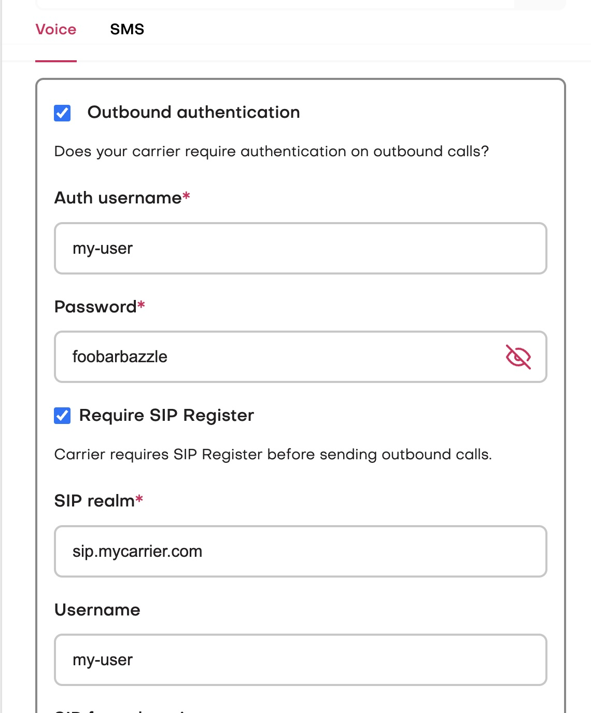

In jambonz, we use the terms "carrier" and "SIP trunk" interchangeably.
jambonz is a "Bring your own carrier" platform, which means that you can connect any sip network provider or device.
You do so by creating a Carrier entity in the jambonz portal. 

Let's go through this step by step, assuming that the term "SIP trunk" is not familiar to you.

## What is a SIP trunk?
A SIP trunk refers to a preconfigured signaling connection that is made over an IP network between two SIP endpoints.
You can essentially think of it as two sets of instructions that allow each SIP endpoint to receive and send 
calls between each other.  

<Note>
And when we say "call", it could be any sort of media exchanged, although generally we are 
speaking of audio calls.
</Note>

If you are using jambonz, it is likely that you have either a SIP trunking provider that you are using that 
you want to connect to jambonz, or a private PBX or SBC that you control which you want to connect to jambonz. 

To connect your remote system or provider to jambonz, you will need that side to create a SIP trunk towards 
jambonz, and you will similarly need to create a SIP trunk towards them.  This is what we mean 
by creating a "Carrier" in jambonz.

## First step: authentication

A big part of establishling a two-way SIP trunk is agreeing on how each side will authenticate the other. 
There are generally two ways to do this:
1. IP whitelisting
2. user/pasword authentication

### IP whitelisting

This approach is quite simple.  Basically, you exchange information about IP addresses with whoever is managing the 
remote side of the connection: you tell them the IPs your SIP signaling will be coming from, and they respond in kind.  

You can find your IP addresses quite easily in the jambonz portal.  When you click to add a Carrier you can see the jambonz SIP 
signaling IPs by expanding the "Have your carriers whitelist our SIP signaling IPs" dropdown.

<Frame caption="Finding your SIP signaling IPs">
  
</Frame>

That gives you the IP addresses that you need to communicate to your carrier; or, if they provide a self-service 
portal (or you are managing the remote side yourself), you configure those IPs yourself on the remote end.

Next, you need to learn from them the SIP signaling IPs that they will sending you traffic from.  These need 
to be static IPs that are well-known and generally don't change over time.  Many carriers will post these IP 
addresses on their website (e.g. 
[Twilio](https://www.twilio.com/docs/sip-trunking/ip-addresses), 
[Simwood](https://support.simwood.com/hc/en-us/articles/360018812579-IP-Addresses-and-Whitelisting)), but if not 
you can ask them directly or enter a support ticket with them.

Once you have their IPs you will add them into the SIP gateways section of Add Carrier page. Note that 
the far end may give you one or more specific IP addresses, or they may also give you a CIDR for a network 
range they own.  In either case, you will click the "plus" sign to add each IP address or CIDR to the list.

We group these far end SIP signaling IPs into two buckets: those that will send jambonz SIP signaling 
traffic for incoming calls (we call these inbound gateways) and those that jambonz will send SIP signaling to 
in order to generate an outbound call (we call these outbound gateways).  

In simple cases, the far end may have a 
single IP that we can use as both an inbound and outbound sip gateway; in that case, we simply  add that IP as a 
sip gateway and check both the inbound and outbound boxes.  In more complex cases, the far end may have a set of 
IPs that they will send us traffic from, but others they want us to use when we send them traffic.  Or, they may 
want us to send to a DNS name when sending them traffic.  In this case, we would add some inbound sip gateways and 
some outbound sip gateways.

<Note>
When you add an outbound sip gateway, you can specify either the far end IP address or a DNS name. 
When adding an inbound sip gateway, though, you must specify an IP address.
</Note>

### User/password authentication

Some SIP trunking providers do not support whitelisting their static IPs.  In such cases, what they usually want 
you to do is to have your SIP gear "register" to them periodically with a username, password, and sip realm value 
that they give you.  Jambonz supports this model as well. 

The way this works is that jambonz periodically authenticates with the far end by sending a SIP REGISTER message, 
using those credentials.  This identifies your end of the SIP trunk to the provider, and thus they know where to 
send your calls.

To enable this method, you will not enter any SIP inbound gateways as you did above, but you will still enter at least 
one outbound gateway.  In most cases, this will be a DNS name that they give you to send the REGISTER to. Then, click 
on "Outbound authentication" and also "Require SIP Register" and fill in the username, password, and sip realm 
value that they gave you. Save those changes and after a short delay jambonz will begin registering with the far end. 
You can see the registation status in the portal.

<Frame caption="Configure sip username/password authentication">
  
</Frame>

## Advanced features
The Carrier panel in the jambonz portal has a number of advanced features that you may need for from time to time, 
depending on your remote SIP trunk provider.  These are described here.

### E.164 syntax

Some carriers require phone numbers to be presented using E.164 syntax, which is basically a '+' followed by 
the country code and phone number.  Checking this box will cause jambonz to present numbers in this format.

### Tech prefix

This is a feature where the dialed number if prefixed by a label that is commonly described in the industry as 
a "tech prefix".  It is not likely that you would need this feature unless the far end SIP server is a private 
PBX with some sort of advanced routing features.

### SIP Diversion header

Some carriers will allow you to put the calling number that will appear as the caller id in a SIP Divrsion header. 
Again, this is fairly rare.

### Pad crypto

When sending outbound SIP calls over TLS there is a bit of a divergence in the industry as to whether the crypto 
attributes in the SDP should be padded or not.  This allows you to adjust that setting to conform to your remote 
sip trunking provider.

### Send OPTIONS plugging

Some SIP trunking providers will provide multiple outbound gateways for you to use and ask you to send SIP OPTIONS 
pings periodically to them in case one is down.  This feature allows you do that and will avoid using an outbound 
gateway that is unresponsive.  

<Warning>
Do not check this option however unless your sip trunking provider has explicitly 
confirmed that they support it.
</Warning>

### Use sips scheme

When sending encrypted SIP signaling over TLS the remote SIP trunking provider may guarantee full end-to-end 
encryption - in which case they will want you to use "sips" -- or they may only support partial encryption, in 
which case they will want you to use "sip".  This setting allows you to adjust that.

