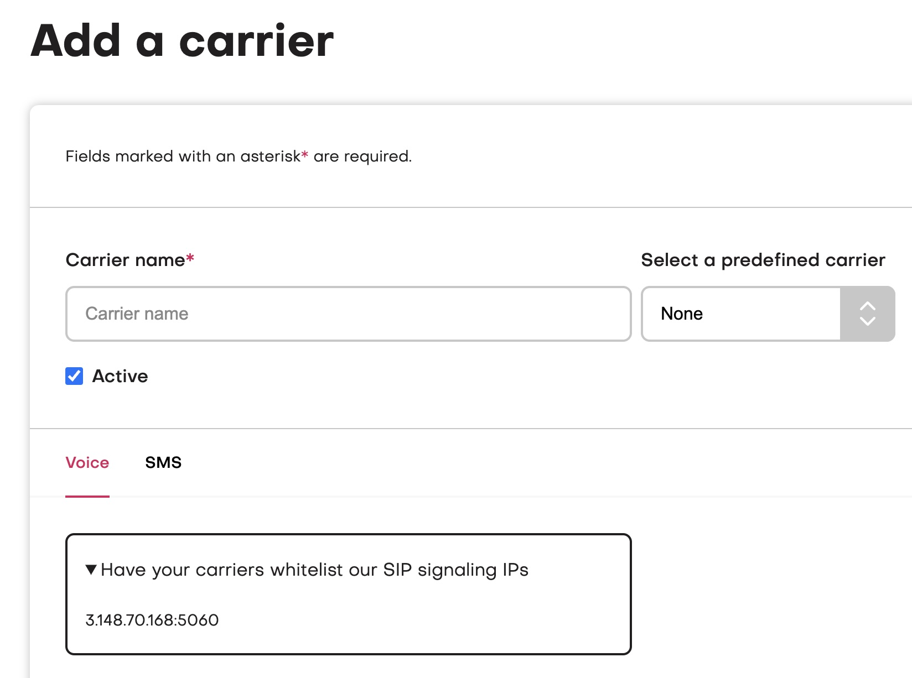
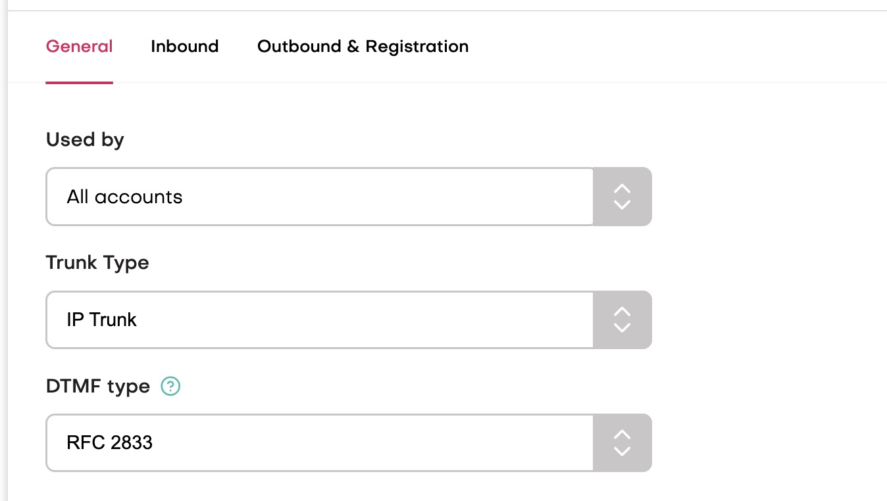
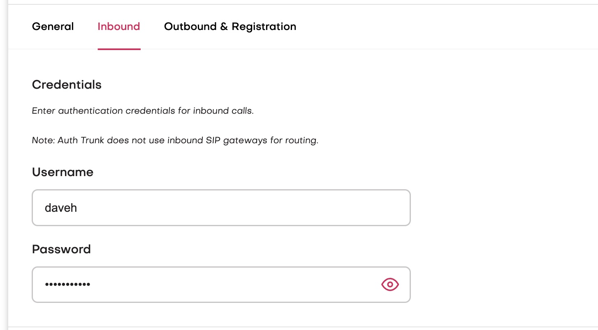
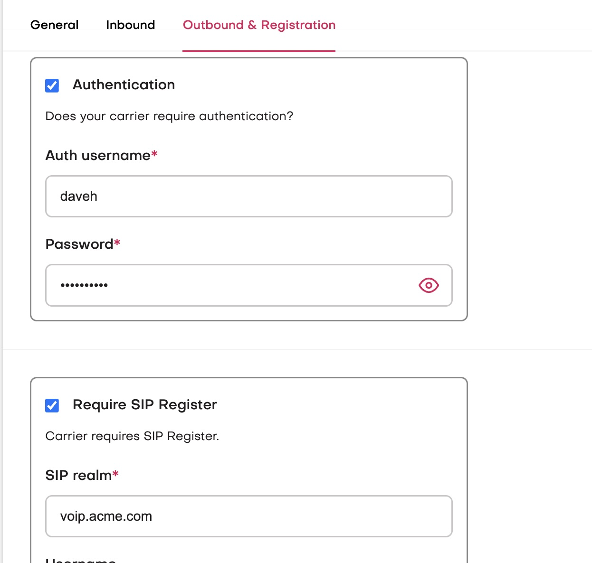
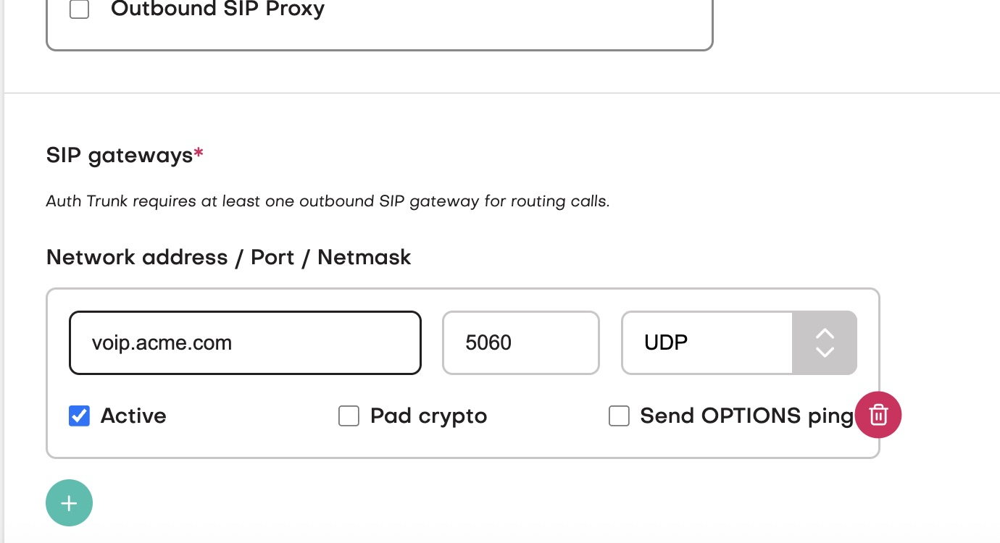

In jambonz, we use the terms "carrier" and "SIP trunk" interchangeably.
jambonz is a "Bring your own carrier" platform, which means that you can connect any sip network provider or device.
You do so by creating a Carrier entity in the jambonz portal. 

Let's go through this step by step, assuming that the term "SIP trunk" is not familiar to you.

## What is a SIP trunk?
A SIP trunk refers to a preconfigured signaling connection that is made over an IP network between two SIP endpoints.
You can essentially think of it as two sets of instructions that allow each SIP endpoint to receive and send 
calls between each other.  

<Note>
And when we say "call", it could be any sort of media exchanged, although generally we are 
speaking of audio calls.
</Note>

If you are using jambonz, it is likely that you have either a SIP trunking provider that you are using that 
you want to connect to jambonz, or a private PBX or SBC that you control which you want to connect to jambonz. 

To connect your remote system or provider to jambonz, you will need that side to create a SIP trunk towards 
jambonz, and you will similarly need to create a SIP trunk towards them.  This is what we mean 
by creating a "Carrier" in jambonz.

## First step: authentication

A big part of establishling a two-way SIP trunk is agreeing on how each side will authenticate the other. 
Jambonz supports three alternative methods for this:
1. IP whitelisting; we call this an "IP trunk"
2. The remote side authenticates to us with a username and password we give them; we call this an "Auth trunk"
3. We authenticate to the remote side with a username and password they give us; we call this a "Registration trunk"

### IP trunks

This approach is the most commonly used and quite simple.  When your SIP trunking provider support IP whitelisting (sometimes referred to as "static IPs")
this is the preferred approach.

Basically, you exchange information about IP addresses with whoever is managing the 
remote side of the connection: you tell them the IPs your SIP signaling will be coming from, and they tell you their SIP signaling IPs.  

You can find your IP addresses quite easily in the jambonz portal.  When you click to add a Carrier you can see the jambonz SIP 
signaling IPs by expanding the "Have your carriers whitelist our SIP signaling IPs" dropdown.

<Frame caption="Finding your SIP signaling IPs">
  
</Frame>

That gives you the IP addresses that you need to communicate to your carrier; or, if they provide a self-service 
portal (or you are managing the remote side yourself), you configure those IPs yourself on the remote end.

Next, you need to learn from them the SIP signaling IPs that they will sending you traffic from, and those IPs they 
want you to send traffic to; we call these respectively the "inbound" and "outbound" gateways.  These need 
to be static IPs that are well-known and generally don't change over time.  Many carriers will post these IP 
addresses on their website (e.g. 
[Twilio](https://www.twilio.com/docs/sip-trunking/ip-addresses), 
[Simwood](https://support.simwood.com/hc/en-us/articles/360018812579-IP-Addresses-and-Whitelisting)), but if not 
you can ask them directly or enter a support ticket with them.

Now select the "IP trunk" option on the Add Carrier page in the jambonz portal.
<Frame caption="IP trunk Carrier type">
  
</Frame>

Next, add their inbound signaling IPs on the Inbound page, and their outbound signaling IPs on the Outbound page.
In simple cases, the far end may have a single IP that we can use as both an inbound and outbound sip gateway; in that case, 
simply  add that IP on both the inbound and outbound pages.

In more complex cases, the far end may have a set of 
IPs that they will send us traffic from, but others they want us to use when we send them traffic.  Or, they may 
want us to send to a DNS name when sending them traffic.  In this case, we would add some inbound sip gateways and 
some outbound sip gateways.

<Note>
When you add an outbound sip gateway, you can specify either the far end IP address or a DNS name. 
When adding an inbound sip gateway, though, you must specify an IP address or CIDR range
</Note>

### Auth trunks

Some SIP trunking providers do not support whitelisting their static IPs.  In such cases, what they sometimes can 
do is use a username, password and SIP realm that you give them to authenticate to jambonz.  When they send us 
a SIP INVITE for a new call, we will challenge them for those credentials using SIP Digest authentication.

If your carrier/SIP trunking provider works this way, they select the "Auth trunk" option for the Trunk Type on the 
Add Carrier page in the jambonz portal.  Then select the "Inbound" tab and enter a username and password that you will 
give them to authenticate with.  You will also tell them the SIP realm associated with your jambonz account, as they 
will need this as well.

<Frame caption="SIP Digest credentials for Auth trunk">
  
</Frame>

You can optionally add outbound gateways as well for an Auth trunk.

### Registration trunks

Finally, some SIP trunking providers do not support IP whitelisting, and instead require us to authenticate to them. 
In this case, they will provide you with the SIP digest credentials (username, password, and sip realm). 

To support this method, select the "Registration trunk" option for the Trunk Type on the Add Carrier page in the 
jambonz portal.  Then, on the Outbound & Registration tab, select "Authentication" and add the username and password 
they have provided.  Next, select "Require SIP Register" and enter the sip realm they have provided.  

<Frame caption="Registration trunk credentials">
  
</Frame>

Finally, add at least 
one outbound sip gateway that jambonz will send the REGISTER messages to.  This is typically a DNS name that they will have provided you, 
and it may be the same or different from the SIP realm.

<Frame caption="Registration trunk outbound gateways">
  
</Frame>

Once we successfully register with the remote system, we will do a DNS lookup on the DNS name we are registering to in order to 
resolve to a set of IP addresses.  Any INVITEs received from those IPs will automatically be accepted as coming from the remote
side of the SIP trunk.

## Advanced features
The Carrier panel in the jambonz portal has a number of advanced features that you may need for from time to time, 
depending on your remote SIP trunk provider.  These are described here.

### E.164 syntax

Some carriers require phone numbers to be presented using E.164 syntax, which is basically a '+' followed by 
the country code and phone number.  Checking this box will cause jambonz to present numbers in this format.

### Tech prefix

This is a feature where the dialed number if prefixed by a label that is commonly described in the industry as 
a "tech prefix".  It is not likely that you would need this feature unless the far end SIP server is a private 
PBX with some sort of advanced routing features.

### SIP Diversion header

Some carriers will allow you to put the calling number that will appear as the caller id in a SIP Divrsion header. 
Again, this is fairly rare.

### Pad crypto

When sending outbound SIP calls over TLS there is a bit of a divergence in the industry as to whether the crypto 
attributes in the SDP should be padded or not.  This allows you to adjust that setting to conform to your remote 
sip trunking provider.

### Send OPTIONS plugging

Some SIP trunking providers will provide multiple outbound gateways for you to use and ask you to send SIP OPTIONS 
pings periodically to them in case one is down.  This feature allows you do that and will avoid using an outbound 
gateway that is unresponsive.  

<Warning>
Do not check this option however unless your sip trunking provider has explicitly 
confirmed that they support it.
</Warning>

### Use sips scheme

When sending encrypted SIP signaling over TLS the remote SIP trunking provider may guarantee full end-to-end 
encryption - in which case they will want you to use "sips" -- or they may only support partial encryption, in 
which case they will want you to use "sip".  This setting allows you to adjust that.

