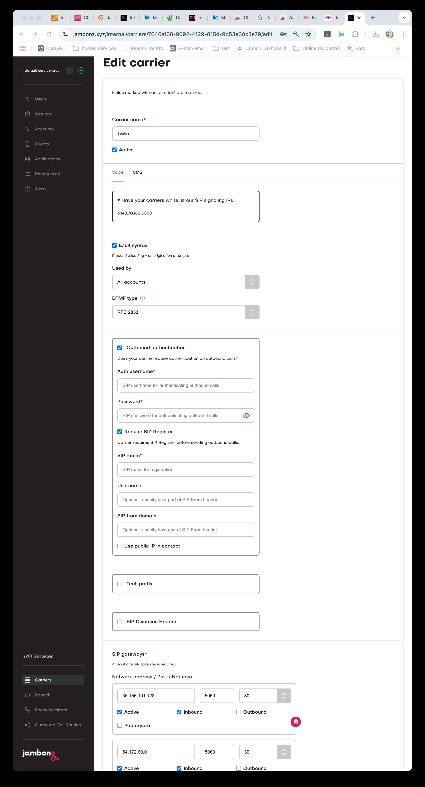
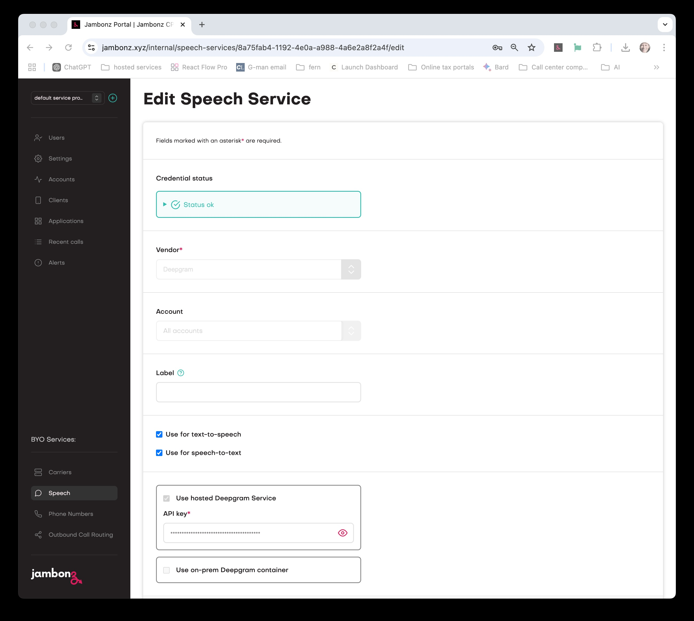
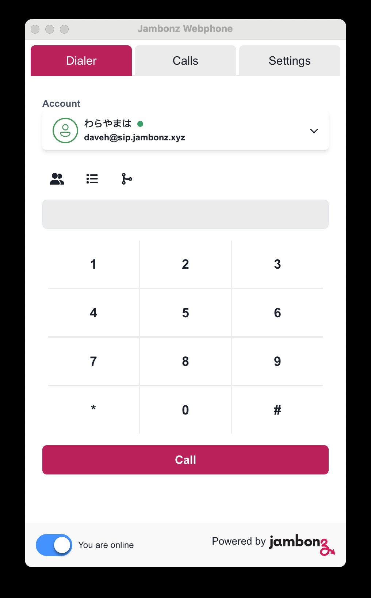
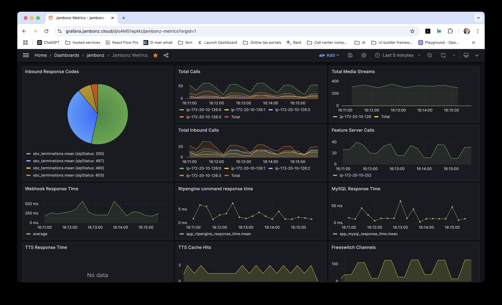

jambonz is the open-source telephony platform used by professionals to deploy Voice AI applications at scale.

What do we mean by that?  Well, it's..

- **Open-source**:  Offered under the MIT open source license, 
 you can white label jambonz as part of your own product, customize it and run it anywhere - our cloud, your cloud or bare metal and air-gapped.
- a **telephony platform**: built by a team with extensive experience building scalable and reliable voice processing systems for some 
of the world's largest telecoms.
- **for deploying Voice AI applications**: jambonz is a "bring your own everything" platform that integrates with all of the major speech and conversational AI vendors, 
allowing you to connect any SIP trunk to low-latency speech and voice AI pipelines created using jambonz.
- **at scale**: jambonz is designed for large enterprises and service providers: horizontally scalable, with a multi-tenant architecture that 
supports many thousands of customers on a single system, but can also scale down to a single server deployment for small businesses or 
individual developers.

Through our customers and partners, jambonz is deployed today in many Fortune 500 companies 
as the underlying voice platform for conversational AI while also being used by SMBs and startups around the globe to deliver innovative voice applications.

## How it works

jambonz allows developers to build voice applications using a simple, declarative JSON-based syntax. 
Using either webhooks or websockets, developers interact with the jambonz platform to handle, create and manage calls.

Sound complicated?  It's not.

Using our [sdks](), you write simple code like this:
```js
session
  .answer()
  .gather({
    say: {text: 'How can we help you today?'},
    input: ['speech'],
    actionHook: '/transcript',
    recognizer: {
      vendor: 'deepgram',
      language: 'en-US',
      hints: ['support', 'sales', 'billing'],
    }
  })
  .send();
```

When an incoming call arrives, jambonz routes the call to a user application based on information such as 
the dialed number or the incoming SIP trunk.  The application responds with a set of verbs (like the 
[gather](/verbs/verbs/gather) verb shown above) that provide instructions to jambonz on how to handle the call.

jambonz also provides a [REST API](/reference/introduction) that allows developers to generate outbound dialing campaigns, modify a call 
in progress, or configure any aspect of the provisioned service.

The list of things you can do with jambonz is extensive, and includes:
- Perform speech-to-text (STT) and text-to-speech (TTS),
- Connect calls to speech LLMs such as OpenAI, Deepgram, Ultravox, and ElevenLabs
- Receive and send bidirectional audio streams directly into a call,
- Create background audio tracks and layer them into a call,
- Record and transcribe calls and save directly to your own cloud storage,
- Manage conferences and call queues,
- Receive calls from webRTC and MS Teams users, 
- and much more.

## Key Concepts

### Verbs
We've already covered one key concept that you will encounter repeatedly in jambonz: verbs.
These are actions that you want jambonz to perform. You aapplication sends lists of verbs to jambonz, receives events and 
other status information from jambonz, and then responds to those events by sending more verbs. So verbs are the 
building blocks of jambonz applications and they are extensively documented [here](/verbs/verbs).

You will find that some verbs are "blocking" - meaning that jambonz will wait to complete the instruction contained 
in the verb before proceeding, while others are "non-blocking" - 
meaning that the verb will begin work and jambonz will immediately move on to the next verb in the list.  We often 
speak of verbs as working in the "background" when they are initiated in a non-blocking way: e.g. a "background transcribe" 
operation can be happening all during a call while your application is interacting with the caller.

### Carriers
jambonz lets you connect to any any SIP trunk provider, PBX or enterprise session border controller (SBC) that you like. 

In the jambonz portal, you will see a "Carrier" section where your can configure your SIP trunks 
(in jambonz we use the terms "carrier" and "SIP trunk" interchangeably).  To configure a 
SIP trunk, you will whitelist the IPs of the carrier from which they will send us traffic, provide information about 
their SIP gateways that we will send traffic to, and configure other authentication credentials.  

<Frame caption="Connect to any SIP trunk provider or PBX">
  
</Frame>

### Speech vendors
jambonz supports a large number of speech vendors (18 as of release 0.9.3!) for speech-to-text (STT) and text-to-speech (TTS) --
and if we don't support your favorite vendor, then you can use our custom speech API to build in support.

When you create applications, you select default vendors to use for STT and TTS, but you can also override these selections 
at any time during the call and you can also specify fallback vendors to use in case the primary vendor is unavailable.

<Frame caption="Use any of our 18 supported speech vendors or add your own">
  
</Frame>

### WebRTC support
jambonz supports WebRTC, allowing you to receive calls from web browsers and other WebRTC clients. In fact, jambonz 
has a Chrome extension that allows you to make webRTC calls directly 
from your browser; this is a great way for developers to easily test their applications while they are developing them.

<Frame caption="Webrtc clients are supported">
  
</Frame>


### Creating low-latency speech pipelines
This is what you came for, right?!!

jambonz allows you to create pipelines that connect SIP trunks to STT and TTS services, to LLMs and to 
stream audio with low end-to-end latency over these connections.  There are several different ways to create these pipelines, including
- using the "streaming" property of the [say]() verb to stream text tokens directly from an LLM through a TTS engine and on to the caller,
- creating a bidirectional audio stream between jambonz and your application by using [stream]() verb, or
- using the [dub]() verb to create additional audio tracks on a call and stream tts or audio files into those tracks.

All of these methods allow you to create low-latency, high-quality speech pipelines that can be used for a wide variety of applications.

## Platform architecture

jambonz can be deployed in a variety of physical configurations, from a single server to highly scalable cluster. 
Regardless of the deployment model, every jambonz system consists of the following components:
- a session border controller function
- a feature server function
- a mysql database
- a redis cache
- a web server
- monitoring and logging, including a grafana dashboard

### session border controller 
The session border controller (SBC) function is responsible for handling the signaling and media for all calls.
The SBC handles functions such as:
- sip registrations, 
- detection and deflection of SIP spam traffic, 
- authentication of incoming calls, 
- media transcoding, 
- SIPREC call / media forking, 
- and more.  

> Note: for customers that have their own SBCs, jambonz can be placed behind the customer's SBC if desired.

### feature server 
The features server is the focal point and workhorse of the jambonz system.  It is responsible for:
- handling incoming calls and routing them to the appropriate application,
- receiving verbs from the user application and processing them,
- connecting the incoming audio stream to external components such as speech recognition engines and LLMs, and
- managing the overall state of the call.

### mysql database
The mysql database contains all of the customer-provisioned data such as:
- phone numbers and SIP trunks,
- user applications,
- speech vendor selections and credentials, and
- user and account configurations.

The mysql database is a multi-tenant database that contain thousands of tenant accounts.

### redis cache
The redis cache is used to store transient data such as:
- sip registrations,
- call state information for calls in progress
- the current state of the jambonz clusters

### web server
The web server hosts the jambonz portal, REST API, and the grafana portal.

### monitoring and alerting
The monitoring and alerting components provide call detail storage and system metrics that are displayed in the 
grafana dashboards.  You can also created alerts based on these metrics.



# How it's built

jambonz is built on top of a number of leading modern, cloud-native, and open-source technologies.
We are proud to be showcasing the work of these outstanding products in our platform, including:
- our own [drachtio SIP server](https://drachtio.org)
- [rtpengine](https://github.com/sipwise/rtpengine) media proxy
- [freeswitch](https://github.com/signalwire/freeswitch) media server
- [homer](https://github.com/sipcapture/homer) sip capture server
- [APIBan](https://www.apiban.org/) sip spam protection
- [Node.js](https://nodejs.org/en)
- [Mysql database](https://www.mysql.com/)
- [Redis](https://redis.io/)
- [Grafana](https://grafana.com/)
- [Influxdb and Telegraf](https://influxdata.com/)
- [OpenTelemetry](https://opentelemetry.io/)
