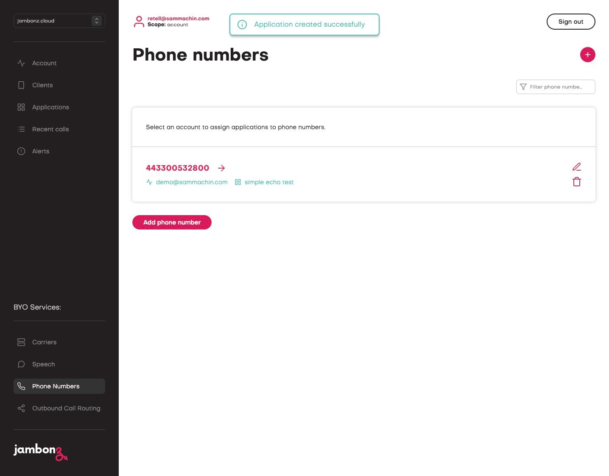

In the previous article we covered the building blocks of the jambonz system; but you, the developer, are 
an important component of jambonz as well! 

After all, jambonz doesn't do anything until you write an application for it. 
In this article we'll cover the basics of building applications for jambonz.

jambonz supports both a webhook and a websocket API for creating user applications, as well as a choice of three SDKs that 
you can use.  These will be described below.

<Note>
These are in addition to the [REST API](/reference/introduction) that allows you to manage your account, provision phone numbers, and so on.
</Note>

jambonz includes the following client SDKs:
- Node.js SDK for the websocket API,
- Node.js SDK for the webhook API, or
- NodeRED nodes to build graphical flows in [NodeRED](https://nodered.org/)

If you are starting out and not quite sure which to use, we recommend websockets. This offers the most flexibility 
in building asynchronous applications which you are likely to eventually need.  Also, some advanced features require the websocket API.  
So we'll look at this first.

## Building a jambonz application using websockets

Let's jump in by using our npx application generator to scaffold a websocket application.

```js
$ npx create-jambonz-ws-app
Usage: create-jambonz-ws-app [options] project-name

Options:
  -v, --version              display the current version
  -s, --scenario <scenario>  generates a sample websocket app for jambonz
                             (default: "hello-world")
  -h, --help                 display help for command


Scenarios available:
- hello-world: a simple app that responds to an incoming call using text-to-speech
- echo: an collect-and-response app that echos caller voice input
- openai-realtime: a conversational voice interface to the OpenAI Realtime API
- deepgram-voice-agent: a conversational voice interface to the Deepgram Voice Agent API
- llm-streaming: example of streaming text tokens from Anthropic LLM
- all: generate all of the above scenarios

Example:
  $ npx create-jambonz-ws-app --scenario "hello-world, echo" my-app
```

You can see this tool will let us scaffold out a new application using one of several scenarios.

Let's start with a basic "echo tester" app that peforms speech-to-text on the caller's utterances and 
repeats it back using text-to-speech.  This is a useful little app to use to test out a new speech 
engine or to verify that a new jambonz system you just provisioned is working properly.

```js
$ npx create-jambonz-ws-app --scenario echo my-echo-app
Creating a new jambonz websocket app in /Users/dhorton/tmp/my-echo-app
Installing packages...
```

That's it!  You've just created your first jambonz application.  In fact you can run it right now, if you want:

```js
$ cd my-echo-app/
$ npm start

> my-echo-app@0.0.1 start
> node app

{
  "level":30,
  "time":1739116350704,
  "pid":31336,
  "msg":"jambonz websocket server listening at http://localhost:3000"
}
```

Now we have a websocket application listening for incoming connections from jambonz on port 3000.  You can see that in this 
case I am running it on my laptop, but in a production environment you would typically run this on a
server in the cloud, a hosted Node.js service, or in a container -- wherever you can run a Node.js 
application and provide a public URL to access it.

Running on your laptop is fine for development and testing, and you can use a service like ngrok to 
provide a public URL for your application. 

Let's look at the code a bit before we configure our jambonz server to connect to this application.

The main app.js file be boilerplate code that you will rarely need to change, but let's take a quick look at it:

```js
const {createServer} = require('http');
const {createEndpoint} = require('@jambonz/node-client-ws');
const server = createServer();
const makeService = createEndpoint({server});
const logger = require('pino')({level: process.env.LOGLEVEL || 'info'});
const port = process.env.WS_PORT || 3000;

require('./lib/routes')({logger, makeService});

server.listen(port, () => {
  logger.info(`jambonz websocket server listening at http://localhost:${port}`);
});
```

It sets up a websocket server listening on port 3000 by default.  

The handlers for various URL paths can be found in the lib/routes folder.  This is where the 
actual application logic can be found. Let's take a look at the echo.js file, which implements 
the 'echo' application:

```js maxLines=100
const service = ({logger, makeService}) => {
  const svc = makeService({path: '/echo'});

  svc.on('session:new', (session) => {
    session.locals = {logger: logger.child({call_sid: session.call_sid})};
    logger.info({session}, `new incoming call: ${session.call_sid}`);

    try {
      session
        .on('close', onClose.bind(null, session))
        .on('error', onError.bind(null, session))
        .on('/echo', onSpeechEvent.bind(null, session));

      session
        .gather({
          say: {text: 'Please say something and we will echo it back to you.'},
          input: ['speech'],
          actionHook: '/echo',
          partialResultHook: '/interimTranscript',
          timeout: 15
        })
        .send();
    } catch (err) {
      session.locals.logger.info({err}, `Error to responding to incoming call: ${session.call_sid}`);
      session.close();
    }
  });
};

const onSpeechEvent = async(session, evt) => {
  const {logger} = session.locals;
  logger.info(`got speech evt: ${JSON.stringify(evt)}`);

  switch (evt.reason) {
    case 'speechDetected':
      echoSpeech(session, evt);
      break;
    case 'timeout':
      reprompt(session);
      break;
    default:
      session.reply();
      break;
  }
};

const echoSpeech = async(session, evt) => {
  const {transcript, confidence} = evt.speech.alternatives[0];

  session
    .say({text: `You said: ${transcript}.  The confident score was ${confidence.toFixed(2)}`})
    .gather({
      say: {text: 'Say something else.'},
      input: ['speech'],
      actionHook: '/echo'
    })
    .reply();
};

const reprompt = async(session, evt) => {
  session
    .gather({
      say: {text: 'Are you still there?  I didn\'t hear anything.'},
      input: ['speech'],
      actionHook: '/echo'
    })
    .reply();
};

const onClose = (session, code, reason) => {
  const {logger} = session.locals;
  logger.info({session, code, reason}, `session ${session.call_sid} closed`);
};

const onError = (session, err) => {
  const {logger} = session.locals;
  logger.info({err}, `session ${session.call_sid} received error`);
};

module.exports = service;
```
A few things to note about this code:
- line 2: The `makeService` function is used to create a service that listens for incoming calls on the `/echo` path.
You can have multiple different services in the same Node.js application, each listening on a different path.
- line 4: The `session:new` event is emitted when a new call arrives. It contains a lot of information about the call,
including all of the SIP headers should your application need them..
- line 5: By convention, if we want to store any user data with the session we use the `session.locals` object.
- line 9-12: We set up event handlers for asynchronous events that we want to respond to.
- line 15: The 'session' object has methods for all the jambonz verbs that you might want to use.
In this case use a [gather](/verbs/verbs/gather) verb to collect speech from the caller along with a 
nested [say](/verbs/verbs/say) verb to prompt them. When we configure this application in jambonz we will set 
default speech recognizer and text-to-speech engines, but we could override those choices here if we wanted to change
the speech vendor for single turn of the conversation.
- line 22: Having called one or more verb methods on the session, we send them back to jambonz for execution.
After this, we are waiting for the next event from jambonz - likely either speech detected, timeout, or caller hangup.
- line 30: When a speech detected event is received, the `onSpeechEvent` function is called.  How did this happen?
Well, we provided an actionHook of `/echo` in the gather verb, and we set up an event handler back on line 12 to 
handle events on the `/echo` path with the `onSpeechEvent` function.

That's it!  The rest of the application is pretty straightforward once you understand the patterns and conventions 
in the code described above.

### Configuring jambonz to use your websocket application

Now that we have our application running, we need to configure jambonz to use it.  This is done in the jambonz portal
by creating a new application.  
- Click on Applications in the left-hand navigation, then click the "+" button.
- Give your application a name, then put your websocket URL in both the `Calling webhook` 
and `Call status webhook` fields.
- Select speech vendors for both speech synthesis and speech recognition, and choose voice and language settings.
- If desired, select fallback speech vendors in case the primary vendors fail.
- Click Save.

<div class="card-video">
<video 
    src="../../assets/save-application.mp4"
    width="600"
    height="480"
    playsinline
    muted
    controls
    loop
>
</video>
</div>

Once your application is saved in jambonz, you can specify a phone number to route to it so that any incoming 
calls on this number trigger the application:
- Click on Phone Numbers in the left-hand navigation, then click the "+" button.
- Select the Carrier / originating SIP trunk and enter the phone number.
- Select the application you just created from the dropdown list.
- Click Save.

Now when you call that number, your application will be triggered and you can test it out!

<video 
    src="../../assets/save-number.mp4"
    width="600"
    height="480"
    playsinline
    muted
    controls
    loop
>
</video>

## Building a jambonz application using webhooks
Now that we've seen how to build a websocket application, let's look at how to build a webhook application.
A lot of this will look familiar based on what you've already seen.

Once again we'll scaffold up the app, except this time we'll use the `create-jambonz-app` tool instead
of `create-jambonz-ws-app`:  

```js
$ npx create-jambonz-app
Usage: create-jambonz-app [options] project-name

Options:
  -v, --version              display the current version
  -s, --scenario <scenario>  generates sample webhooks for specified scenarios, default is dial and tts
                             (default: "tts, dial")
  -h, --help                 display help for command


Scenarios available:
- tts: answer call and play greeting using tts,
- dial: use the dial verb to outdial through your carrier,
- record: record the audio stream generated by the listen verb,
- auth: authenticate sip devices, or
- all: generate all of the above scenarios

Example:
  $ npx create-jambonz-app my-app
```

We'll create a simple "hello,world" app.

```js
$ npx create-jambonz-app -s tts my-hello-world
Creating a new jambonz app in /Users/dhorton/tmp/my-hello-world
Installing packages...
```

Once again, the app.js is mostly boilerplace that you won't need to edit, but there are some differences 
since this is a webhook application instead of a websocket server.

```js
const assert = require('assert');
assert.ok(process.env.JAMBONZ_ACCOUNT_SID, 'You must define the JAMBONZ_ACCOUNT_SID env variable');
assert.ok(process.env.JAMBONZ_API_KEY, 'You must define the JAMBONZ_API_KEY env variable');
assert.ok(process.env.JAMBONZ_REST_API_BASE_URL, 'You must define the JAMBONZ_REST_API_BASE_URL env variable');

const express = require('express');
const app = express();
const {WebhookResponse} = require('@jambonz/node-client');
const basicAuth = require('express-basic-auth');
const opts = Object.assign({
  timestamp: () => `, "time": "${new Date().toISOString()}"`,
  level: process.env.LOGLEVEL || 'info'
});
const logger = require('pino')(opts);
const port = process.env.HTTP_PORT || 3000;
const routes = require('./lib/routes');
app.locals = {
  ...app.locals,
  logger,
  client: require('@jambonz/node-client')(process.env.JAMBONZ_ACCOUNT_SID, process.env.JAMBONZ_API_KEY, {
    baseUrl: process.env.JAMBONZ_REST_API_BASE_URL
  })
};

if (process.env.HTTP_USERNAME && process.env.HTTP_PASSWORD) {
  const users = {};
  users[process.env.HTTP_USERNAME] = process.env.HTTP_PASSWORD;
  app.use(basicAuth({users}));
}
app.use(express.urlencoded({ extended: true }));
app.use(express.json());
if (process.env.WEBHOOK_SECRET) {
  app.use(WebhookResponse.verifyJambonzSignature(process.env.WEBHOOK_SECRET));
}
app.use('/', routes);
app.use((err, req, res, next) => {
  logger.error(err, 'burped error');
  res.status(err.status || 500).json({msg: err.message});
});

const server = app.listen(port, () => {
  logger.info(`Example jambonz app listening at http://localhost:${port}`);
});
```

You can see that some additional environment variables are needed.  This is because if we need to 
issue asynchronous requests during the call we will be using the [REST api](/reference), which requires 
an account SID and API key. 

<Note>This overhead is one reason why we recommend websockets for highly 
asynchronous applications.</Note>

The routes are once defined in the lib/routes/endpoints folder.  Lets look at the code for "hello-world":

```js maxLines=100
const router = require('express').Router();
const WebhookResponse = require('@jambonz/node-client').WebhookResponse;
const text = `<speak>
<prosody volume="loud">Hi there,</prosody> and welcome to jambones! 
jambones is the <sub alias="seapass">CPaaS</sub> designed with the needs
of communication service providers in mind.
This is an example of simple text-to-speech, but there is so much more you can do.
Try us out!
</speak>`;

router.post('/', (req, res) => {
  const {logger} = req.app.locals;
  logger.debug({payload: req.body}, 'POST /hello-world');
  try {
    const app = new WebhookResponse();
    app
      .pause({length: 1.5})
      .say({text});
    res.status(200).json(app);
  } catch (err) {
    logger.error({err}, 'Error');
    res.sendStatus(503);
  }
});

module.exports = router;
```

Note the similarities to the websocket application: in both cases we have a `Session` object that has methods 
corresoonding to the jambonz verbs. Running this application is exactly the same as the websocket application, with the exception that you need to provide 
the additional environment variables.  

Provisioning the application in jambonz is also similar; 
the only difference is that the call status webhook is diferent than the calling webhook.  This is because
each has its own distinct path, as we can see in `lib/routes/index.js`:

```js
const router = require('express').Router();

router.use('/call-status', require('./call-status'));
router.use('/hello-world', require('./tts-hello-world'));

module.exports = router;
```

For those you familiar with the [express](https://expressjs.com/) HTTP middleware, this will feel very familiar.


## Building a jambonz application using NodeRED

This guide shows you how to install the jambonz package for Node-RED and also setup ngrok to allow jambonz to send webhooks to Node-RED running on your local machine.
It assumes that you have already:
- [Installed Node-RED](https://nodered.org/docs/getting-started/local)
- [Created an ngrok account](https://ngrok.com) 
- Setup your jambonz account with a carrier, phone number and speech provider.

1\. Navigate to your Node-RED editor eg [http://127.0.0.1:1880/](https://www.google.com/)


2\. Open the Hamburger Menu


3\. Click "Manage palette"


4\. Click the "Install" tab


5\. Type "jambonz" in the search bar, then click the "install" button


6\. Click "Install"


7\. Next install the "ngrok" package in the same way Click "install"


8\. Click "Close"


9\. On the left hand side is the pallette, scroll down to find the ngrok node


10\. And drag it onto the canvas, then double click to open the node


11\. Click the + button to add a new ngrok auth config


12\. enter your ngrok authtoken and give it a name like "authtoken"


13\. Click "Add"


14\. Click "Done"


15\. Now scroll the pallette to the bottom and you will see the jambonz nodes, drag a "webhook in" node to the canvas, then double click it to open the config.


16\. Click the "Path" field. and enter "/call", then click "Done"


17\. Next drag a say node from the palette onto the canvas, and double click it to edit.


18\. Click the "Text {{ }}" field.


19\. Type "Hello world, this is jambonz managed by Node-RED"


20\. Click "Done"


21\. Click here.


22\. Now wire together the nodes so that the webhook In is connected to say and then say to webhook out.


23\. Click here.


24\. Drag a debig node from the palette to the canvas and wire it to the ngrok node


25\. Now click "Deploy" to save your flow.


26\. Click the button on the ngrok node to activate your ngrok tunnel


27\. Now click on the debug icon in the right hand panel


28\. You should see the ngrok hostname for your session in the degug bar, click the icon to copy that value to your clipboard


29\. In a new tab, navigate to [https://jambonz.cloud/](https://jambonz.cloud/)


30\. Login


31\. Click "Applications"


32\. Click "Add application"


33\. Click the "Application name*" field.


34\. Type "node-red ngrok"


35\. Click the "Calling webhook *" field.


36\. Paste your ngrok url from node red here and add "/call" to the end


37\. Click the "Call status webhook *" field.


38\. Paste your ngrok url from node red here and add "/status" to the end


39\. Scroll down and click  "Save"


40\. Now goto your  "Phone Numbers"


41\. Click on your configured phone number to edit it.




42\. Click the "Application" field.


43\. select your new application "node-red ngrok"


44\. Click "Save"


45\. If you now call your number you will hear the text configured in the say node.


