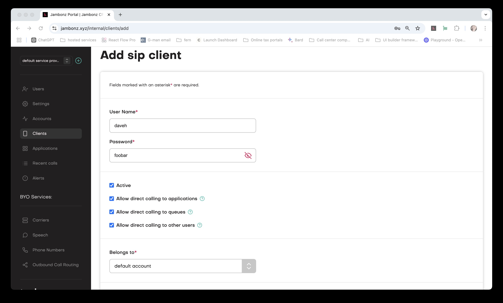
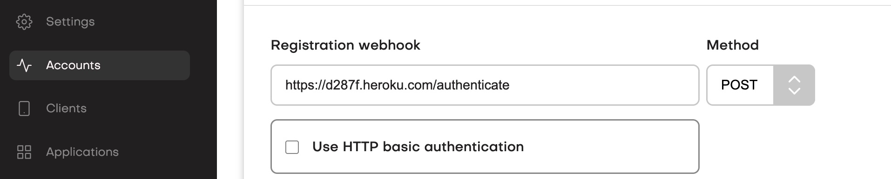

When an incoming call arrives at jambonz the platform must immediately determine two things:

1. Which account, if any, is this call associated with?
2. Which jambonz application should be invoked to handle this call?

In this article we will walk through how those decisions are made - that is, how inbound calls are routed to applications.

## The role of the jambonz SBC

All incoming calls to jambonz are first received by the jambonz Session Border Controller (SBC) function. The SBC is the
the public-facing functional component of jambonz that handles SIP and RTP traffic which may be coming from the public internet 
or from private networks outside of the virtual private network (VPC) or CIDR that jambonz is running in.  

The SBC handles traffic going in and out of the jambonz platform, 
and we call the incoming traffic "inbound" and the outgoing traffic "outbound". When a SIP INVITE arrives at the SBC, 
the SBC must first classify this call as either inbound or outbound.  This is done by looking at the 
remote signaling IP address and determining whether the call originated from within the jambonz VPC or not.  If the call 
originated from within the VPC, then it is an outbound call; otherwise it is an inbound call.

Once the SBC has classified the call as inbound, the processing is then handled by the [sbc-inbound](https://github.com/jambonz/sbc-inbound) 
application, which is then responsible for answering the two questions above.

## Determining the account

We can further break down inbound calls into three categories:
1.  calls coming from a provisioned Carrier/SIP trunk,
2.  calls coming from a SIP device or endpoint that will authenticate based on a SIP username and password, or 
3.  spam traffic not belonging to any jambonz account that should be rejected.

### Calls from a Carrier

When a call arrives at the SBC from a provisioned Carrier, the SBC will first check the source IP address of the incoming call
jambonz therefore first checks the source IP address of the incoming call to determine whethert this IP is associated 
with [a sip gateway provisioned in jambonz](/guides/using-the-jambonz-portal/basic-concepts/creating-carriers#ip-whitelisting) 
as part of a Carrier.

If the source IP _is_ associated with a Carrier, then we are closer to determining the account, but there is an additional consideration - 
it's possible that multiple accounts may be using the same SIP trunking provider.  For instance, multiple customers/accounts 
may be using Elastic SIP Trunking from Twilio, ancd in this case when jambonz sees an incoming call from Twilio it can not 
determine the account based on source IP alone.  

For that reason, jambonz next looks at the called phone number (i.e. the value in the user part of the Request URI of the SIP INVITE). 
Based on the combination of the source IP and the called phone number, jambonz can now determine the specific account associated with this call.

### Calls from a SIP device

If an incoming call is not from a provisioned Carrier jambonz next checks to see if the call is from a SIP device or endpoint that 
is associated with an account.  Each account in jambonz can have a SIP Realm value, which is a unique DNS name (usually a subdomain) 
that is assigned to the account so that they can authenticate to jambonz via SIP username and password.  

If the incoming call has a 
DNS name in the host part of the Request URI instead of an IP (e.g. `INVITE sip:15083245098@account_xyz@sip.jamboinz.cloud`), then jambonz 
will search for an account associated with that DNS name, which we call a SIP Realm value. If an account is found, then jambonz will challenge 
the incoming SIP request to authenticate using [SIP digest authentication](https://datatracker.ietf.org/doc/html/rfc8760).  This involves 
sending a 401 or 407 response challenge to the incoming SIP request that forces the far end to authenticate using a username and password which 
has been granted to them by the owner of the jambonz account.  The call will continue only If the far end can authenticate successfully.

#### Granting credentials

##### Static credentials
There are two ways that an account owner in jambonz can grant SIP credentials. 
The first, and simplest, is to create a SIP user directly in the jambonz portal. 
This involves navigating to the "SIP Users" section of the portal and creating a new user, 
specifying the username and password that the SIP device or endpoint will use to authenticate.

<Frame caption="Creating a sip user">
  
</Frame>

<Note>
The "Allow direct calling.." checkboxes in the image above unlock additional features in the jambonz chrome plugin dialer.
These can be very helpful if you intend use the chrome dialer with these credentials, but otherwise have no affect. 
</Note>
You can then give out this username and password, along with the sip realm value that you can see in the Account panel, to someone 
who can then configure a SIP endpoint to use to authenticate to jambonz.  The SIP endpopoint may be a device or softphone, a webrtc user, or a PBX.

##### Dynamic credentials

The second method allows you to keep the credentials outside of jambonz and dynamically make a decision to authenticate calls 
as they arrive, via a webhook that jambonz invokes.  To implement this method, create a webhook application that receives an HTTP POST 
and then provision the URL in the Account panel of the jambonz portal. 

<Frame caption="Using a registration webhook">
  
</Frame>

Your webhook application will receive a POST with a JSON body that contains the following properties:
- `username`: the username that the far end is attempting to authenticate with
- `realm`: the SIP realm value that the far end is attempting to authenticate with
- `expires`: the expiry value being requested by the far end SIP endpoint
- `source_ip`: the source IP address of the incoming call
- `source_port`: the source port of the incoming call
- `method`: the SIP method of the incoming request (either INVITE or REGISTER)
- `uri`: the Request URI of the incoming request
- `nonce`: the nonce value in the Authorization header of the incoming request
- `nc`: the nc value in the Authorization header of the incoming request
- `cnonce`: the cnonce value in the Authorization header of the incoming request
- `qop`: the qop value in the Authorization header of the incoming request
- `response`: the response hash calculated by jambonz

Based on that information, and the password which yoju have stored separately, your webook can verify the response hash.
If the response hash is correct, that means that the SIP endpoint used the correct password and you should allow the 
call to continue by returning a 200 OK response with JSON payload like below:

```json
{
  "status": "ok",
  "expires": "300"
}
```

To see a detailed example, please checkout [this repo](https://github.com/jambonz/customer-auth-server)
or you can watch this longer video that walks through the process step by step.

<div class="card-video">
<video 
    src="../../assets/sip-device-registrations.mp4"
    width="600"
    height="480"
    playsinline
    controls
>
</video>
</div>

## Determing the application

### Calls from a Carrier 

When the call is from a Carrier, jambonz will look at the called phone number and 
determine which application to invoke based on the number.  Once you have created a Carrier 
in the jambonz portal, you then [provision phone numbers](/guides/using-the-jambonz-portal/basic-concepts/creating-phone-numbers)
 that are associated with that Carrier and specify the application that should be invoked 
 for each.

 ### Calls from a SIP device

  When the call is from a SIP device, jambonz will a special application to invoke. 
  This application is configured in the Account panel of the jambonz portal.  All calls 
  from authenticated sip devices or users will be routed to this application.

  **That's a wrap, folks!** 
  
  We've just walked through how jambonz responds to an incoming call 
  and determines both the jambonz account and application that should be invoked to handle the call.