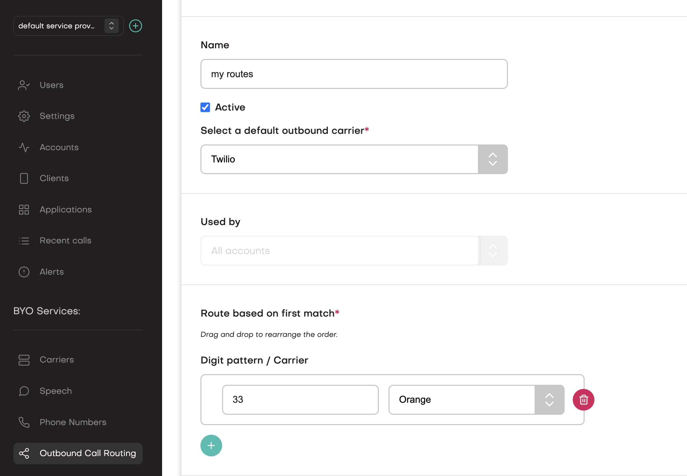

When your application instructs jambonz to place an outbound call, either by using the 
[dial](/verbs/verbs/dial) verb or by using the [REST API](/reference/rest-call-control/calls/create-call), 
it is usually quite straightforward for jambonz to decide where to send the call:

- if you are calling phone number, and you have provisioned a single carrier, or
- if you are calling a SIP URI, or
- if you are calling a registered sip client.

In each of these cases the call routing decision is simple:
- case 1: send the INVITE to the provisioned carrier/SIP trunk
- case 2: send the INVITE to the SIP URI
- case 3: send the INVITE to the registered sip client

However, when you have provisioned multiple outbound carriers in jambonz and you 
are dialing a phone number ([target="phone"](/verbs/verbs/dial#target-types) in the dial verb), 
then a decision must be made as to which of your provisioned carriers to use.  

This article describes the outbound routing features that jambonz provides to assist in this 
decision. Let's look at the options you have.

## Explicitly specify the carrier

The simplest way to route an outbound call is to explicitly specify the carrier to use in the 
dial verb or api call.  You can do this in the dial verb by using the `trunk` property in the 
list of `targets`.  In the `trunk` property you can specify the name of the carrier as you 
provisioned it in the jambonz portal.

```js
session.dial({
  callerId: '15086908019',
  target: [
    {
      type: 'phone',
      number: destination,
      trunk: 'My Best Carrier'
    }
  ],
})
.send();
```

In the case above, the call will be routed to the carrier that is associated with your 
account that you named 'My Best Carrier'.

If you are using the REST API to create an outbound call, you can specify the carrier 
similarly, in the [to.trunk](/reference/rest-call-control/calls/create-call#request.body.to.trunk) 
property of the request body.

## Destination-based routing

Let's say you have a carrier that you want to use to route calls to a specific country 
because they offer cheap rates there.  However, all other calls you want to use a 
different carrier.  You can accomplish this by using setting up 
outbound call routes in the jambonz portal. 

<Frame caption="Creating outbound call routes">
  
</Frame>

In the example above we create outbound call routes that will use Orange for any calls 
that we deliver to France (country code 33), while all other calls will go out Twilio.

In our example we had only one digit pattern but you can have any number of them and you 
can drag and drop them to indicate the order of evaluation.

Each digit pattern can be simply a digit string, or alternatively a regex pattern. When you provide 
digits, jambonz will match this route if the dialed number starts with the digits you provide. 
If you provide regex, jambonz will match the route if the dialed number matches the regex pattern.

<Note>
Example: perhaps you want to route four-digit extension numbers to a PBX while all other 
calls go out a PSTN carrier.  You could use a regex pattern like `^\d{4}$` to match any extension 
calls and route them out a trunk to your hosted PBX.
</Note>

## Random selection 

If you have multiple carriers that you want to use for outbound calls, and you don't use 
either of the two options above, then jambonz will randomly select one of the carriers to use. 
Carrier roulette!

