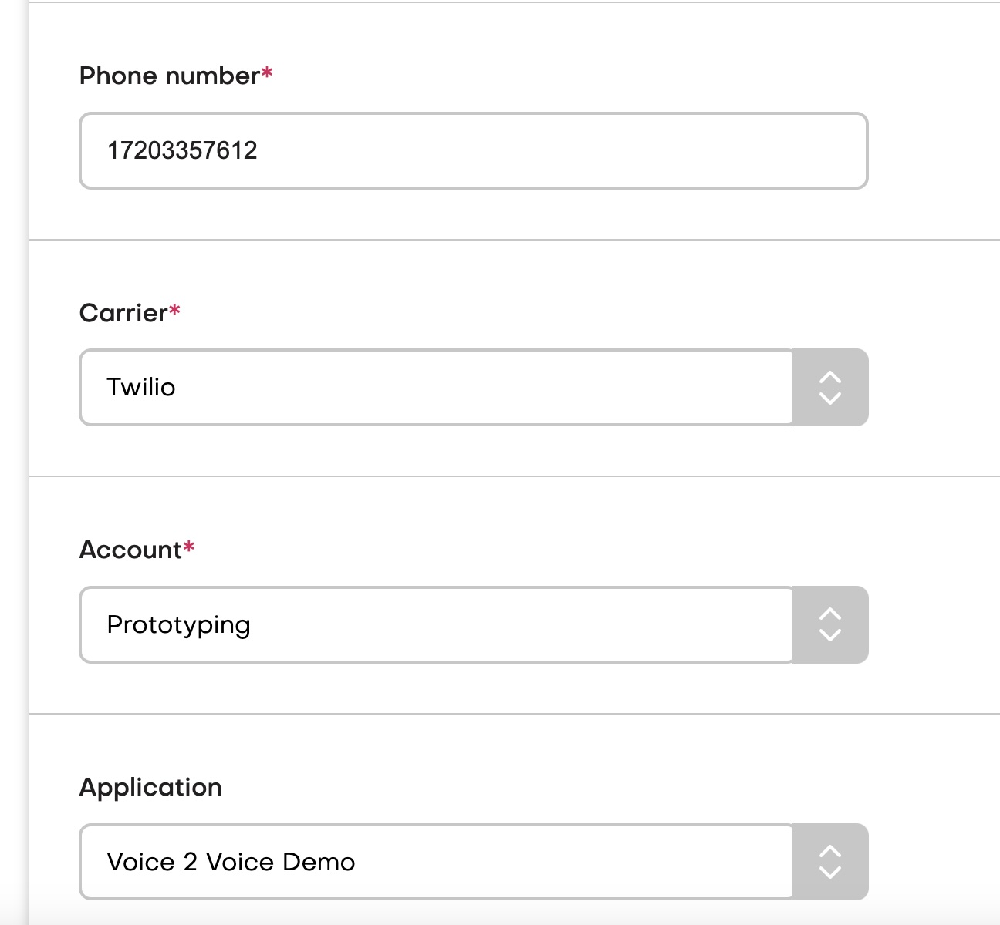

Because jambonz is a "Bring your own carrier" platform we do not sell you phone numbers, SIP trunks,
or minutes.  Instead, you bring your own carriers and phone numbers to the platform.  This allows you to connect 
jambonz to any carrier or SIP PBX.  And it allows you to use your existing phone numbers that you have 
already purchased from your SIP trunking/DID provider.

These phone numbers however must be provisioned on jambonz if you want to route different calls to 
different applications based on phone numbers.  So after [creating a carrier](/guides/using-the-jambonz-portal/basic-concepts/creating-carriers),
the next step is to provision the phone numbers that you will be receiving calls on from that carrier.

To provision a phone number, select Phone Numbers from the lefthand navigation and click the '+' sign to 
add a phone number.  Enter the phone number starting with country code.

<Note>
Your carrier might deliver phone numbers with a leading "+" sign, but do not include the plus sign, 
when provisioning a number on this screen,
</Note>

Select the SIP trunking carrier that the phone number is associated with, and then select the application 
that you want calls to route to when your customers call this number.  Click Save and you are done!

<Frame caption="Provising a phone number">
  
</Frame>

Want to learn more about how incoming calls are routed to applications in jambonz?
Check out [this article](/guides/using-the-jambonz-portal/basic-concepts/how-inbound-call-routing-works).
