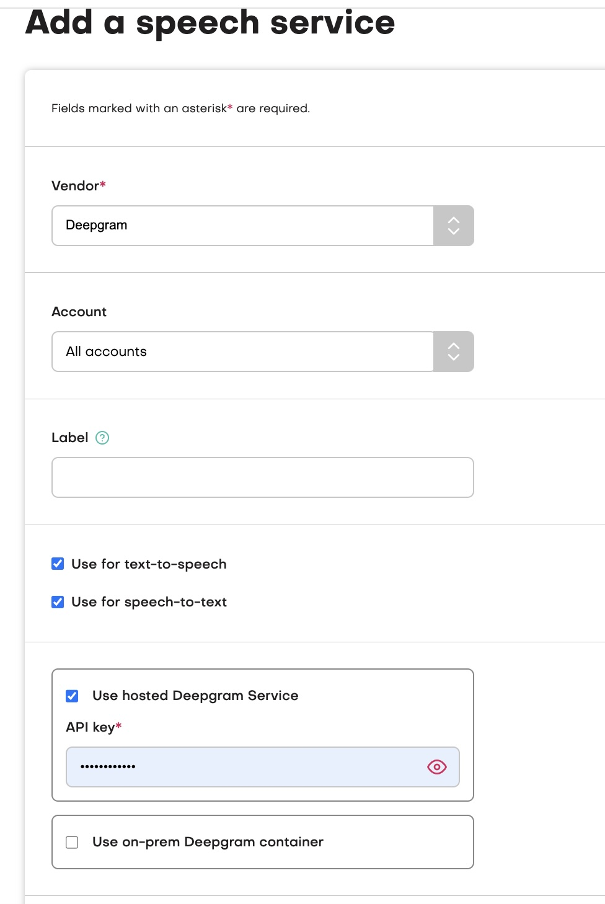
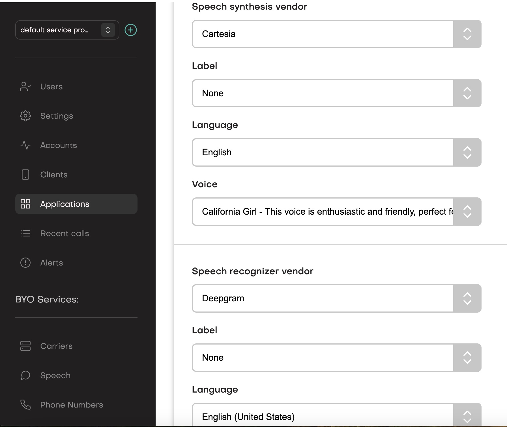

jambonz implements a "best of breed" approach when it comes to speech credentials, allowing you to work with 
the vendor of your choice.  You provision services with your chosen vendor and then plug the api key or other 
credentials into jambonz.

<Note>
jambonz supports 18 different speech vendors at last count, and if you want to work with a vendor that we don't 
yet support you can use our custom speech API to build in support.
</Note>

## Provisioning speech credentials

To provision speech credentials, select Speech from the lefthand side navigation and click the "+" sign to add a new 
speech credential.  You will be prompted to select a vendor and then enter the credentials for that vendor.

<Warning>
You can optionally associate a label with the speech credential.  This is useful only if you need to 
enter more than one set of credentials for a given vendor.  As an example, if you were using Microsoft in the 
eastus region and then wanted to add a second credential, also for Microsoft but in the eastus2 region, you would 
add them both with a unique label to distinguish.  

However, if you are only using one set of credentials per 
vendor then leave the label field blank.
</Warning>

<Frame caption="Provising speech credentials">
  
</Frame>

## Selecting speech vendors for an application

You configure your speech credentials one time, and then as you create jambonz applications you can decide 
which of provisioned vendors to use.  

<Frame caption="Select speech vendor for an application">
  
</Frame>

## Using different speech vendors during the same call

You can also override the default speech credentials at any point during a call.
To do so, you configure the [say](/verbs/verbs/say) verb with a `synthesizer` property 
that specifies the vendor and voice to use for this specific text to speech request, or configure the 
[gather](/verbs/verbs/gather) verb with a [recognizer](/verbs/verbs/recognizer) property that specifies the vendor, 
language and possibly other properties for this specific speech to text request.

