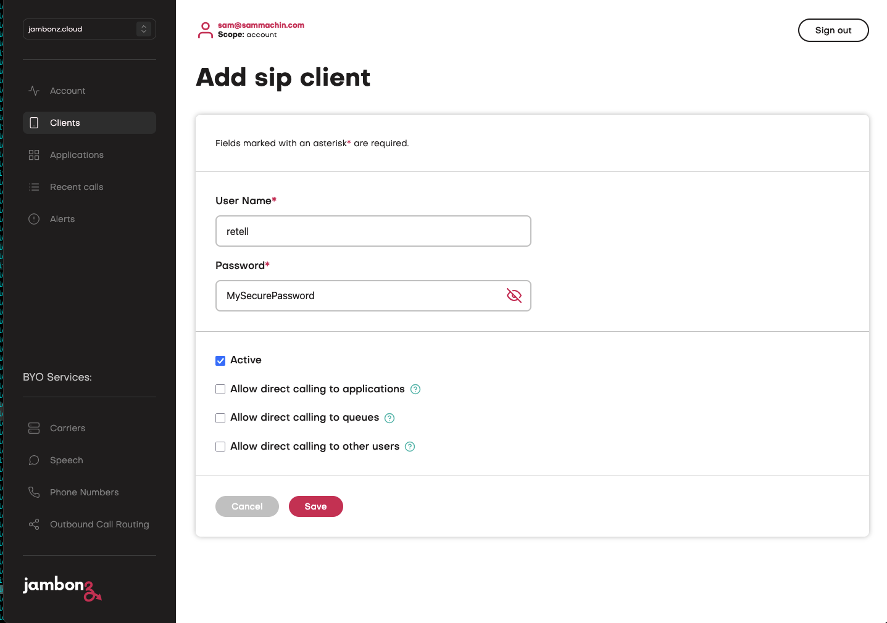
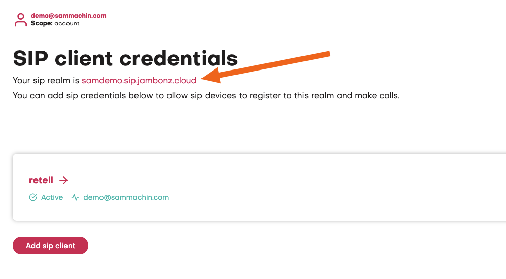
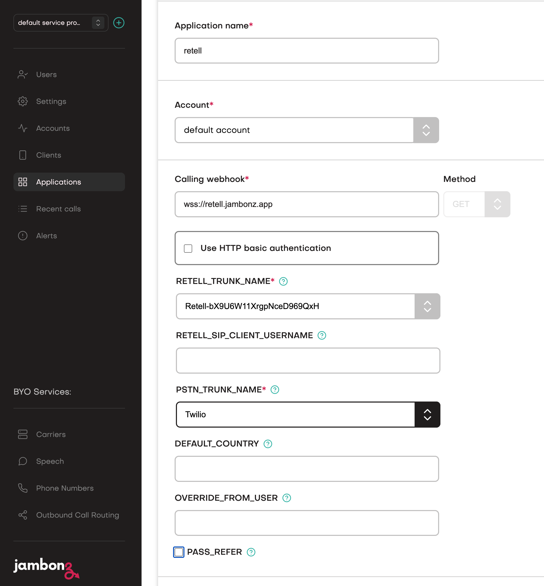
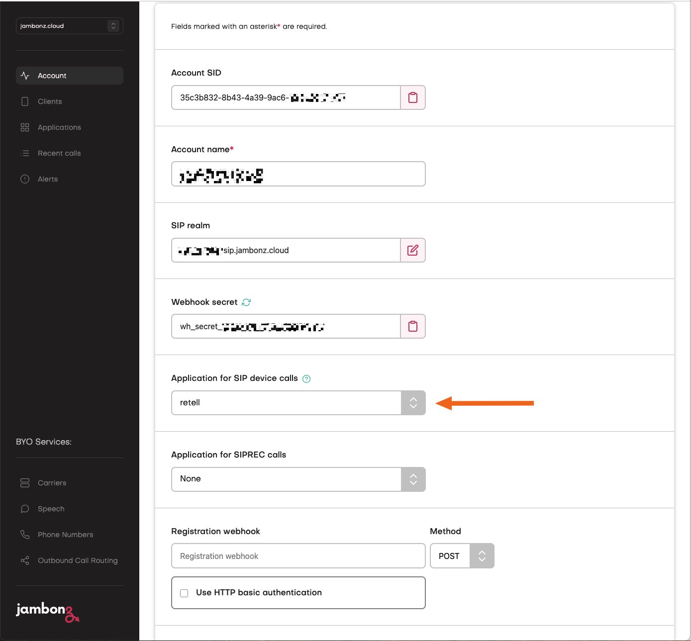
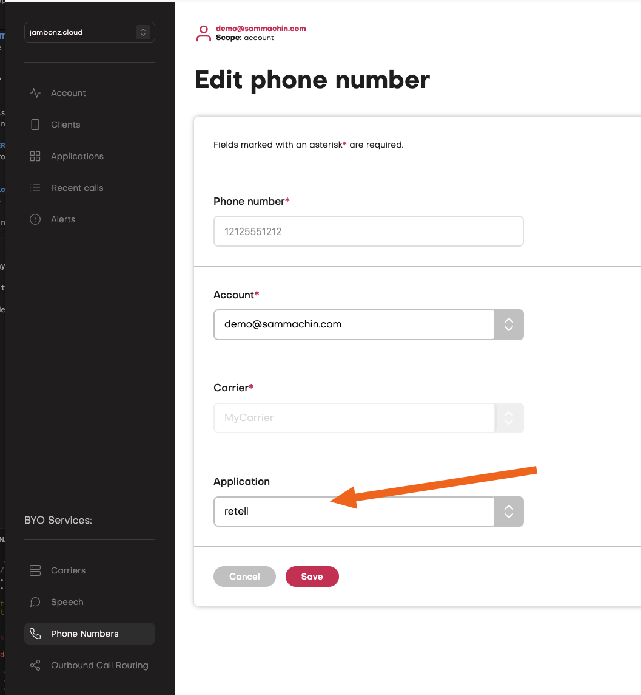
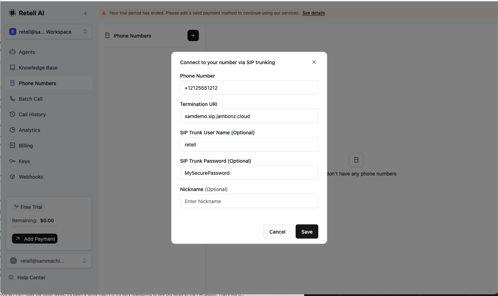

The Retell hosted app allows you to connect a call to retell from any SIP provider, it also supports Retell transferring the call via SIP refer or a new outbound leg.

It can be used for both inbound and outbound calls, with outbounds calls you would initiate the call by making a REST API request to the [Create Call endpoint](https://docs.jambonz.org/reference/rest-call-control/calls/create-call)

# Requirements
Before setting up the hosted application you will need:
- A Jambonz Account,
- A Retell account,
- A SIP carrier configured in your jambonz account for connecting to the PSTN.
- A Phone number configured in your jambonz account for the above carrier.

# Get started

## SIP client

You will need to create a new Client in your jambonz account in order for retell to make outbound calls, on the Clients tab of the jambonz UI click the + icon and then create a new username and password, 
make a note of the username and password you created and then click **save**
<Frame>
  
</Frame>

When you are returned to the client list screen you should also see a SIP Realm at the top of the page, make a note of this too
<Frame>
  
</Frame>


## Application

Login to your jambonz account, goto applications and click the + icon to create a new application.

Enter the name of your application, this can be anything, we suggest starting out with `retell`
Enter the Calling Webhook below, the same value should be automatically copied to the Call Status Webhook.
```txt Calling Webhook
wss://retell.jambonz.app
```

<Frame>
  
</Frame>

When you enter the webhook some new fields will then appear beneath that as shown below, these are the Application Environment variables
for this hosted application. We'll go through how you should configure these next.


## Client Application

Now that you have created your application you need to configure you account so that calls made using the SIP client are routed to this application.

On the account page scroll dow to `Application for SIP device calls` and select the name of the application you just created.

<Frame>
  
</Frame>

## Configuration

### RETELL_TRUNK_NAME
You can leave this as the default of `retell-hosted` on jambonz.cloud as there is a shared carrier already created with the correct settings.

### RETELL_SIP_CLIENT_USERNAME
Set this to the name of the SIP client you created earler on for retell to connect to.

### PSTN_TRUNK_NAME
The name of your SIP carrier in Jambonz that you want retell to use for outbound calls.

### DEFAULT_COUNTRY
If you experience issues with your carrier sending the destination number in local format set this to the ISO-3166 country code of your number and the application will 
rewrite the number into the proper International e.164 format expected by Retell. The code is 2 characters for example `us` or `gb` [Full List](https://en.wikipedia.org/wiki/List_of_ISO_3166_country_codes) 

### OVERIDE_FROM_USER
When making calls from Retell to then PSTN your carrier may want you to use a custom value in the From header, if so set this here. Sipgate is one such carrier.


## Other Configuration
The other parameters can be left as default.

Now link your phone number to this application on the phone numbers page.
<Frame>
  
</Frame>


## Retell Configuration

Now you can login to your Retell account and add a new phone number, select `Connect to your number via SIP Trunking` and then enter;

Your PSTN number from your carrier (note this needs to be in e.164 format eg +12125551212)
The sip realm you noted earlier as the Termination URI
In the SIP Trunk User Name enter the user of the client you created
In the SIP Trunk Password enter the password of the client you created.

<Frame>
  
</Frame>


Now you can associate that number with your retell agent and process calls.


# Help & support
If you experience any issues with using the Hosted application via Jambonz.cloud then please email support@jambonz.org and include a call_sid for an example call that shows the issue along with the date & time of the call.

Please also mention that you are using the Retell Hosted application.

You can view the code for this application on our [GitHub](https://github.com/jambonz/retell-hosted)


