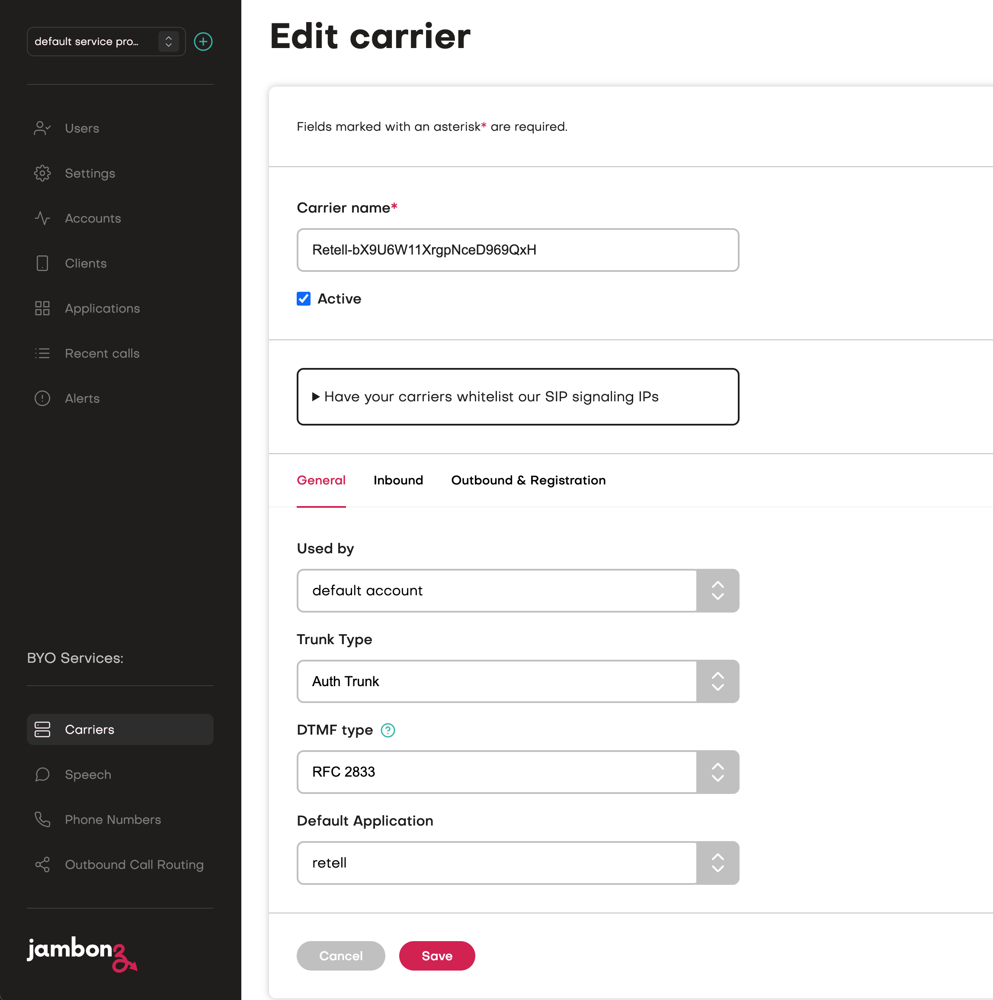
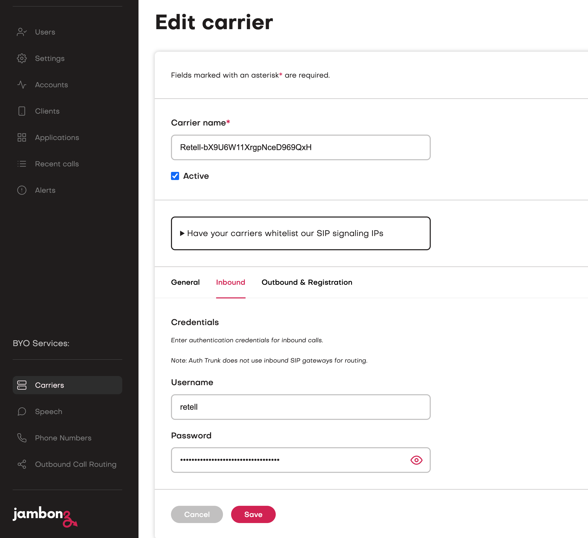

The Retell hosted app allows you to connect a call to retell from any SIP provider, it also supports Retell transferring the call via SIP refer or a new outbound leg.

It can be used for both inbound and outbound calls, with outbounds calls you would initiate the call by making a REST API request to the [Create Call endpoint](https://docs.jambonz.org/reference/rest-call-control/calls/create-call)

# Requirements
Before setting up the hosted application you will need:
- A Jambonz Account,
- A Retell account,
- A SIP carrier configured in your Jambonz account for connecting to the PSTN.
- A Phone number configured in your Jambonz account for the above carrier.

# Get started

## Carrier

Login to your Jambonz account, go to Carriers and click Add Carrier. Select Retell from the dropdown "Select a predefined carrier". This will automatically update the carrier name and set the Trunk Type to Auth Trunk.
In the Default Application field, select an application that will be used when an INVITE is received for a phone number that is not defined in the Jambonz portal.

<Frame>
  
</Frame>

Select the Inbound tab and enter a username and password that Retell will use for SIP authentication.

<Frame>
  
</Frame>

The Outbound gateway will have already been populated for Retell, so no changes are required on the Outbound & Registration tab.

<Note>
The existing retell-hosted carrier is a deprecated version. If you are already running the Retell application with the retell-hosted carrier, it will continue to work as normal. New users should follow the steps provided here to create the carrier using the Predefined Carrier option.
</Note>


## Application

Go to Applications and click the Add Application button to create a new application.

Enter the name of your application, this can be anything, we suggest starting out with `retell`
Enter the Calling Webhook below, the same value should be automatically copied to the Call Status Webhook.
```txt Calling Webhook
wss://retell.jambonz.app
```
When you enter the webhook some new fields will then appear beneath that as shown below, these are the Application Environment variables
for this hosted application. We'll go through how you should configure these next.

<Frame>
  
</Frame>


## Configuration

### RETELL_TRUNK_NAME
Set this to the name of the carrier you created earlier for Retell.

### RETELL_SIP_CLIENT_USERNAME
This field is only needed for the deprecated retell-hosted carrier. If you created the carrier as instructed above, leave this empty.

### PSTN_TRUNK_NAME
The name of your SIP carrier in Jambonz that you want retell to use for outbound calls.

### DEFAULT_COUNTRY
If you experience issues with your carrier sending the destination number in local format set this to the ISO-3166 country code of your number and the application will 
rewrite the number into the proper International e.164 format expected by Retell. The code is 2 characters for example `us` or `gb` [Full List](https://en.wikipedia.org/wiki/List_of_ISO_3166_country_codes) 

### OVERIDE_FROM_USER
When making calls from Retell to then PSTN your carrier may want you to use a custom value in the From header, if so set this here. Sipgate is one such carrier.

### PASS_REFER
Controls if a refer is sent to the originating carrier or treated as a new outbound leg, see the Call Transfer section.

## Other Configuration
The other parameters can be left as default.

Now link your phone number to this application on the phone numbers page.
<Frame>
  
</Frame>


## Retell Configuration

Now you can login to your Retell account and add a new phone number, select `Connect to your number via SIP Trunking` and then enter:

Your PSTN number from your carrier (note this needs to be in e.164 format eg +12125551212). 
The sip realm you noted earlier as the Termination URI. 
In the SIP Trunk User Name enter the username you defined when creating the Carrier.  
In the SIP Trunk Password enter the password you defined when creating the Carrier.

<Frame>
  
</Frame>


Now you can associate that number with your Retell agent and process calls.

## Retell Call Transfer

The Retell agent has the ability to transfer either an inbound or outbound call to another number, There are a few configuration options within retel that will impact how this transfer is passed to Jambonz.

You can choose a Cold or Warm Transfer, and within a Cold Transfer you can choose to send the Agents Number or the Original Callers Number.

A Cold Transfer with the Retell Agent`s Number or a Warm Transfer will initiate a new outbound call leg from retell through Jambonz, this will be seen to Jambonz as a brand new call and will use a 2nd instance of your availble channels.
Retell and Jambonz remain in the call path for the duration of the call, if you have selected a Warm Transfer there are some additional options where retell will play messages to either of the parties on the call.

If you select a Cold Transfer with the Transferee's Number then retell will send a SIP REFER message back to Jambonz, at this stage you have 2 options depending on the configuration of the PASS REFER flag in your application configuration at Jambonz.
If set to True then Jambonz will send the SIP REFER on to your originating carrier, if they support SIP REFER then they will transfer the call from Jambonz to the new destination, once this is completed both Retell and Jambonz are completely out of the call path.

If PASS REFER is set to false then Jambonz will turn the SIP refer into a new outbound call leg from Jambonz via your carrier, this will then remove retell from the call path but keep the call in Jambonz, it will only use one of your availble channels.

### Override Carrier & Number
Sometimes you may want to transfer the call to an internal number like on your PBX, Retell only allows you to enter full valid phone numbers here and not to use a private mnumber like 1000,
The application provides the ability to override these by sending custom SIP headers from Retell in the call transfer. 

If you set a header of `X-Override-Carrier` then value should contain the name of the trunk you want to use for for the call, this will override the PSTN_TRUNK_NAME in your application configuration
If you set a header of `X-Override-Number` then the value will contain a number to be sent to the carrier instead of the destination number set in the Retell transfer node

These headers can be used independently to override either the carrier or the number.


# Help & support
If you experience any issues with using the Hosted application via Jambonz.cloud then please email support@jambonz.org and include a call_sid for an example call that shows the issue along with the date & time of the call.

Please also mention that you are using the Retell Hosted application.

You can view the code for this application on our [GitHub](https://github.com/jambonz/retell-hosted)


