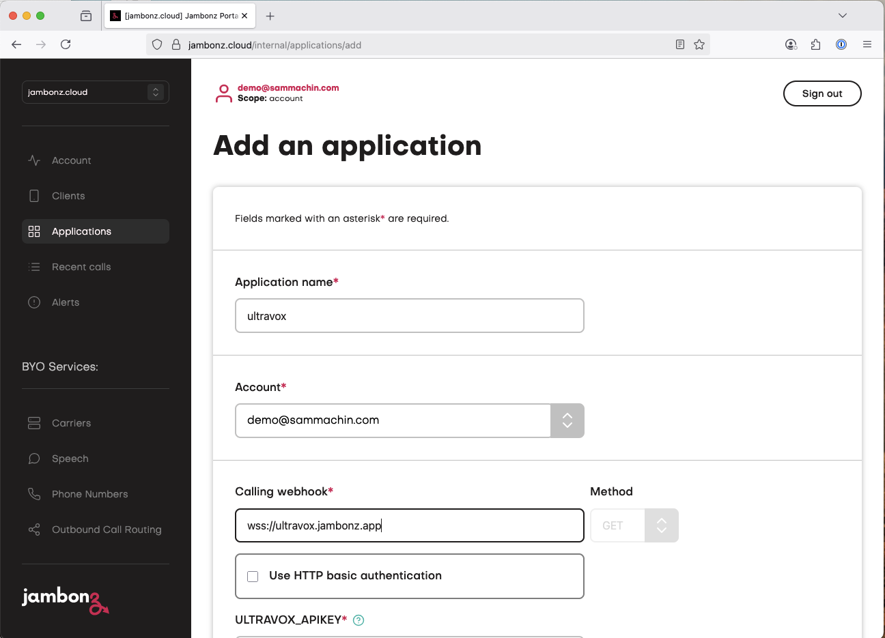
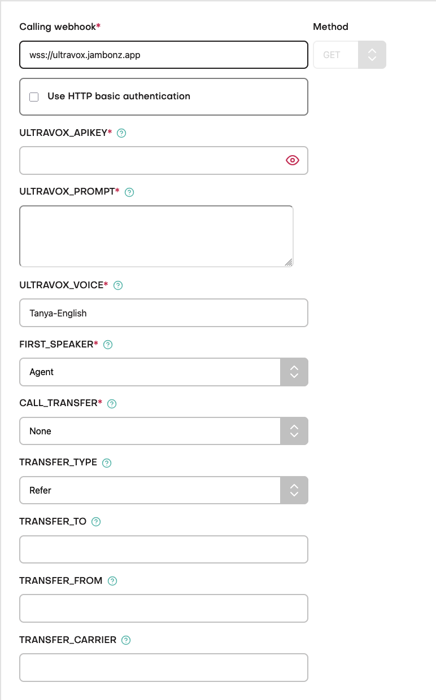

The Ultravox hosted app allows you to connect a call to an Ultravox agent and provide an initial prompt to the agent, optionally you can also allow Ultravox to transfer the 
call to a live human agent by specifying a transfer type, method and the appropriate carrier details.
It can be used for both inbound and outbound calls, with outbounds calls you would initiate the call by making a REST API request to the [Create Call endpoint](https://docs.jambonz.org/reference/rest-call-control/calls/create-call)

## Requirements
Before setting up the hosted application you will need:
- A Jambonz Account 
- An Ultravox account, signup up [ultravox.ai](https://app.ultravox.ai/)
- An API key from ultravox, from the Settings page of the ultravox app
- A Carrier configured in your jambonz account
- If you are using the warm transfer option, a Text to Speech provider to be  setup in your jambonz account for playing the summary.

## Get started

Login to your jambonz account, goto applications and click the + icon to create a new application.

Enter the name of your application, this can be anything, we suggest starting out with `ultravox`
Enter the Calling Webhook below, the same value should be automatically copied to the Call Status Webhook.
```txt Calling Webhook
wss://ultravox.jambonz.app
```

<Frame>
  
</Frame>

When you enter the webhook some new fields will then appear beneath that as shown below, these are the Application Environment variables
for this hosted application. We'll go through how you should configure these next.

<Frame>
  
</Frame>

## Configuration

### ULTRAVOX_APIKEY
This is the API key for your ultravox account, by default the value will be hidden in the UI but you can check it using the eye icon

### ULTRAVOX_PROMPT
The the system prompt given to the agent at the start of the call instructing it what to do, see [https://docs.ultravox.ai/gettingstarted/prompting]() for more details.

You can either upload a pre-existing text file using the `Choose a file` picker or you can type directing into the text area.

Note: You cannot use additional tools with the hosted application, if you wish to expose tooling to the agent you will need to run your own application.

### ULTRAVOX_VOICE
The  voice ultravox will use to respond to the caller, see [https://docs.ultravox.ai/voices/overview]() for details, we default to the `Tanya-English` voice

### FIRST_SPEAKER
Who is expected to speak first on the call, typically this would be the **Agent** for an inbound call or the **User** for an outbound call.


### CALL_TRANSFER
If you want to enable the feature that allows Ultravox to initiate a transfer to a human agent, set this to either `Cold` or `Warm`, It will then expose a tool to the agent and add some instruction to the prompt.

**Cold** Will just transfer the caller to the human agent number with no introduction, also known as Unattended Transfer

**Warm** Will call the human agent and when they answer play a short summary of the call so far before connecting the caller to the agent, the caller does not hear this summary, also known as Attended Transfer

<Warning>If using warm transfer the TRANSFER_TYPE must be set to Dial, & you must have a Text to Speech provider configured for the application to read the summary.</Warning>

### TRANSFER_TYPE
How Jambonz should initiate the call leg to the human agent,

**Refer** will send a SIP REFER message to the carrier of the user call instructing it to transfer directly to the human agent number, once complete Jambonz will be out of the call.

**Dial** will initiate a new outbound call from Jambonz and then connect the user to that dropping the connection to Ultravox, Jambonz remains in the call path.

### TRANSFER_TO
The number that calls should be transferred to

### TRANSFER_FROM
If using a Dial this is the CallerID that will be sent on the call to the agent.

### TRANSFER_CARRIER
If using a Dial this is the Carrier Jambonz will use for the new outbound call.


## Other Configuration
Finally, set the other Jambonz application parameters, if you are using the Warm Transfer option then you will need to select a Speech Provider here that you have configured settings for, the other parameters can be left as default.

Optionally you may want to enable call recording for this application.

## Help & support
If you experience any issues with using the Hosted application via Jambonz.cloud then please email support@jambonz.org and include a call_sid for an example call that shows the issue along with the date & time of the call.

Please also mention that you are using the Ultravox Hosted application.

You can view the code for this application on our [GitHub](https://github.com/jambonz/ultravox-hosted)


