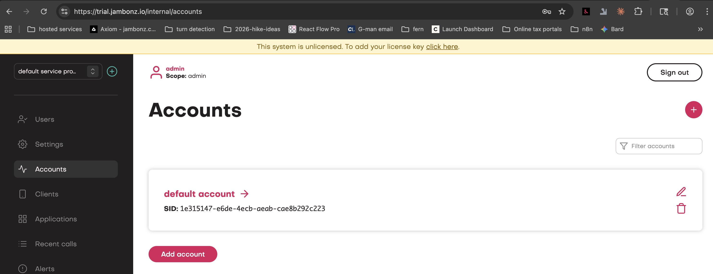
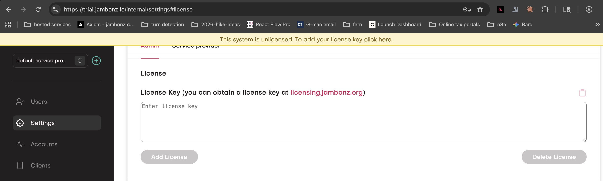
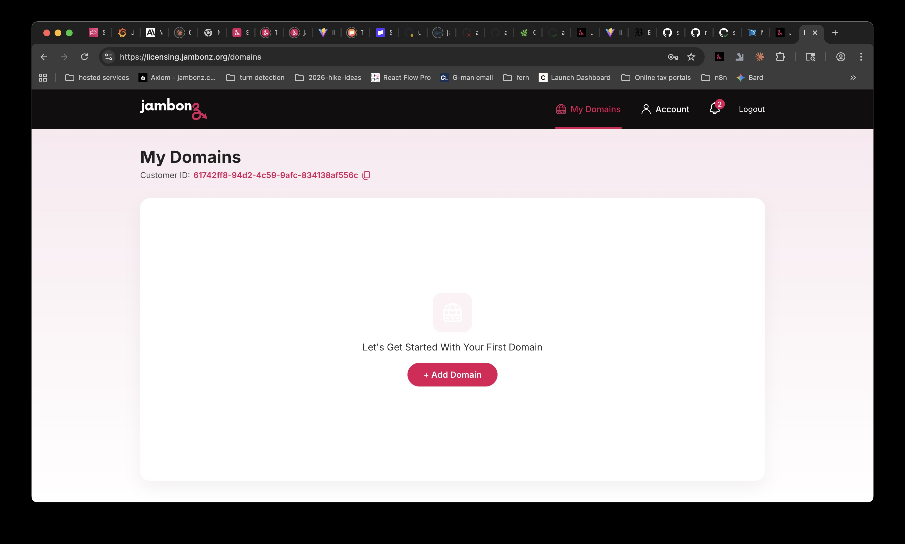
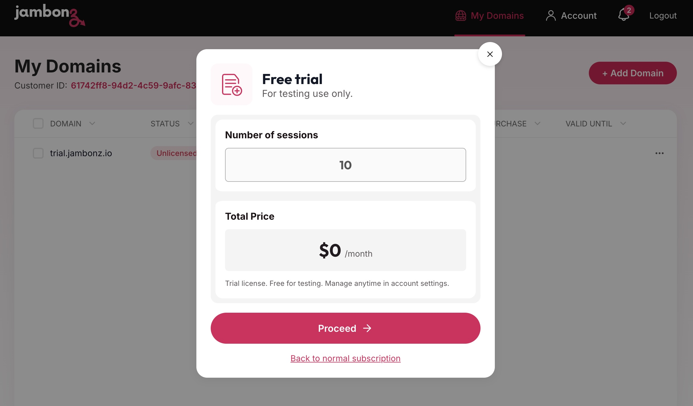
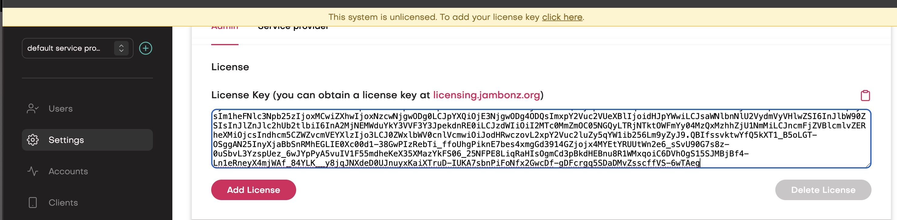

## Overview
Self-hosted jambonz requires a software license key.  The license key is tied to the domain name 
you choose when you deploy jambonz on your infrastructure.

Once you have followed the instructions to deploy the jambonz system, you are ready to obtain a software license. 
When you first log into the jambonz portal,
you will see a beige banner at the top of the window indicating that the system is unlicensed.

Clicking on the link on the Settings page will take you to the settings page where you can enter a license key. 
You will see there a link to the [licensing portal](https://licensing.jambonz.org).

## Creating an account on the licensing portal

Clicking on that link will take you to the licensing portal. Create an account using either email or google login and then sign in.
You will see a page listing the jambonz domains that you have deployed.  It will initially be empty.

## Adding your deployed domain
Click on the "Add Domain" button to add your deployed jambonz domain.  You will be prompted to enter the domain name at the top 
of the page.  Enter the domain name you specified during deployment and then click the Add button.  You will see your 
domain has been added to the list with a status of "Unlicensed".

## Obtaining a license key
Click on the "Buy license key" button for the domain that you just added. 

### Free trial license
You can obtain a free trial license key for evaluation purposes that is good for 30 days.
To do so, click on the "Request Trial License" at the bottom of the Add License popup.
This will bring you to the Free trial form as shown below.

Note that by default trial licenses are restricted to 10 concurrent sessions. 
If you feel you need a higher concurrent session limit for your evaluation, please contact us to request that.

Click on the Proceed button and you will see your trial license key displayed and you can now copy it to the clipboard.

<Note>
Trial licenses are limited to one per domain. Once you have used your free trial, you will need 
to purchase a paid license. If you need an extended trial for 
non-commercial use, please contact us at support@jambonz.org.
</Note>

### Production license
To purchase a production license, click on "Buy License" on the Domains page and then select or enter the desired number of concurrent sessions or "Unlimited".
Click on the "Proceed to purchase" button to review and accept the license terms.

Once you have accepted the terms you will be taken to the payment page to enter your payment details.
After entering your payment details and pressing the Pay button, you will see your license key displayed.

<Note>
Subscription licenses are billed monthly. 
Once the initial license key is installed in your jambonz system, it will automatically update 
monthly with no interruption in service as long as your payment method remains valid.  

You will 
be notified via email if a recurring payment fails for any reason, and you will have an opportunity to
update your payment method before service is interrupted.
</Note>

## Installing your license key
Copy the license key from the licensing portal and return to your jambonz portal settings page.
Paste the license key into the License Key field and click the "Add License" button.

Voila!  Your jambonz system is now licensed and ready for production use.

<Note>
It may take thirty seconds or so for the jambonz SIP server to recognize the new license key and begin accepting calls.
</Note>

## Upgrading a trial license
To upgrade a trial license to a production license, log into licensing portal and click on the dropdown 
menu for the domain with the trial license.  Select "View" and then "Upgrade License". 

## Canceling a license
To cancel a production license, log into the licensing portal and click on the dropdown menu for the domain with the 
license you wish to cancel.  Select "Modify" and then on the subsequent dialog box click on 
"I'd like to cancel my subscription".

You will see that the license status changes to "Final Bill Cycle".
You will have full use of the license until the end of the current billing cycle, 
at which point the license will expire
and your jambonz system will revert to unlicensed status. 
