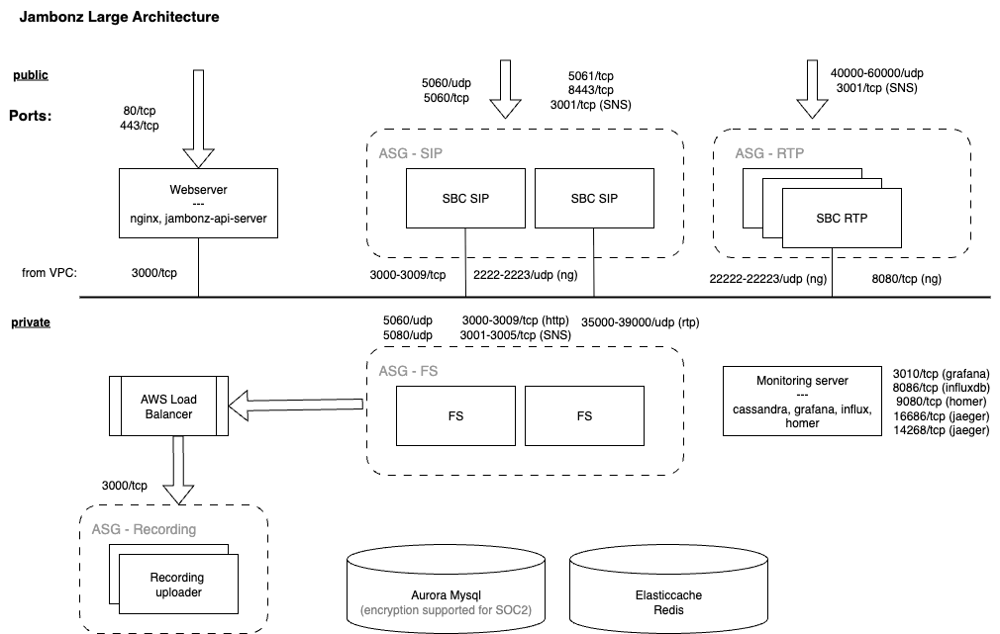

This section provides information on how to deploy jambonz on your own hosting provider or data center.

<Note>
jambonz can be self-hosted on AWS, Azure, GCP, OCI, Kubernetes (EKS, AKS, GKE, SKS), and on bare metal or any VPS via our [Debian package install path](/self-hosting/bare-metal). See the per-environment guides in the left sidebar.
</Note>

## Choosing a Deployment Size

When self-hosting jambonz, it's important to choose a deployment size that matches your expected call volume and usage patterns. 
In our VM-based deployments, we offer three standard deployment sizes:
- **jambonz mini**: A single server suitable for development, testing, and small production workloads (up to 50 concurrent calls).
- **jambonz medium**: A clustered deployment designed for growing businesses and production environments (up to 1,500 concurrent calls).
- **jambonz large**: A clustered deployment designed for high-volume applications (unlimited concurrent calls).

If you are new to jambonz, we recommend starting with a jambonz mini deployment to 
familiarize yourself with the platform and minimize costs.
You can deploy a medium or large deployment later as your needs grow, and you may want to keep the jambonz mini for 
development and staging purposes.

## Licensing

Running a self-hosted jambonz system requires a license key. 
Licenses are keyed to the domain name that you choose for your jambonz server or cluster during the deployment process.

Once you have deployed jambonz on your self-hosted infrastructure, you can obtain a license key as described in the
[Licensing](/self-hosting/licensing) article.  Free trial licenses are available for evaluation purposes.

<Note>
Extended free licenses are available for non-commercial usage and pre-revenue startups.
Contact us at support@jambonz.org for details.
</Note>

## Architecture
The physical architecture of your self-hosted jambonz deployment will depend on the deployment size you choose.
In each case, however, the jambonz system will contain the same logical components:
- **Session Border Controller (SBC)**: A session border controller function that handles SIP and RTP media processing with the outside world.
- **Feature Server**: The central application processing function that connects to speech and AI services as well as your application.
- **Web / Monitoring Server**: Supports the jambonz portal and grafana monitoring dashboards as well as exposing a REST API for management and configuration.
- **Recording Server**: (optional) Handles call recording uploading to your S3 or other cloud storage.
- **Databases**: A mysql database that stores configuration, call detail records, and other data, as well as an InfluxDB time-series database for monitoring data.
- **Redis Cache**: A redis cache used for SIP registrations as well as other ephemeral data.

The image below shows the architecture of a jambonz large deployment on AWS.

The jambonz large deployment consists of multiple horizontally scalable clusters. 
The session border controller function is split into separate SIP and RTP clusters, and there 
are clusters for the Feature Servers and (optionally) the Recording Servers as well. 
The web and monitoring servers are deployed on separate instances.

The jambonz medium deployment is similar, but combines the SIP and RTP functions into a single SBC cluster,
and the web and monitoring components are combined onto a single server.  The Feature Server and 
Recording Server clusters are configured similarly to the large deployment.

Finally, the jambonz mini deployment runs all of the jambonz components on a single server or VM.

