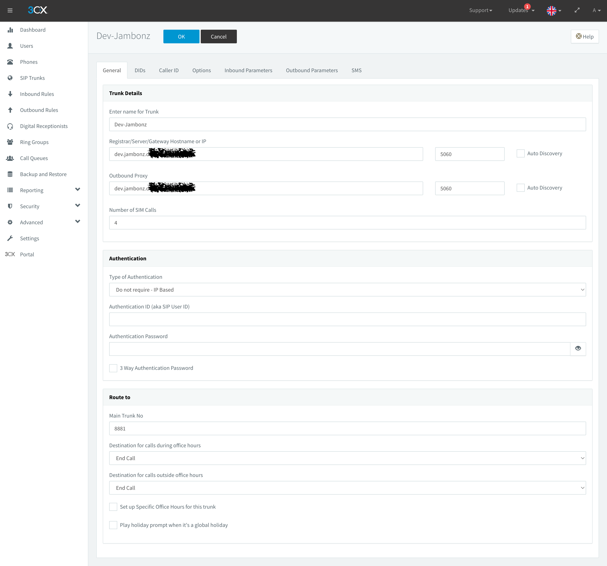
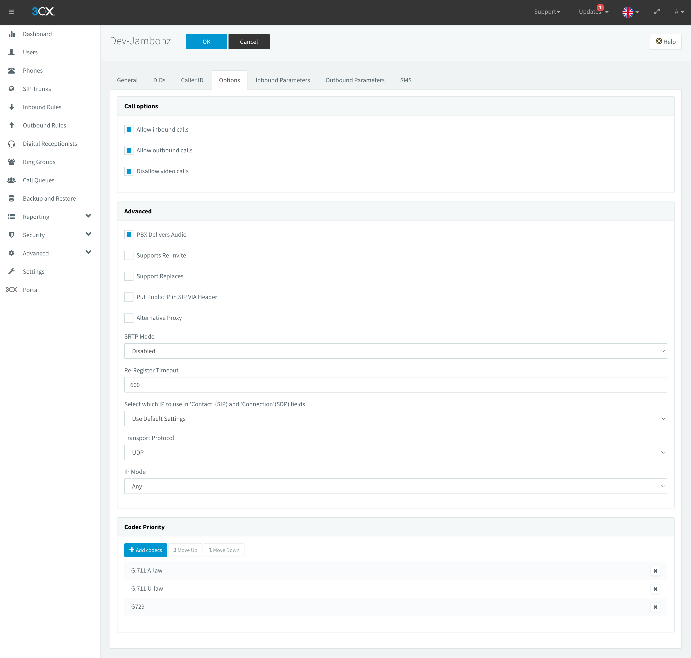
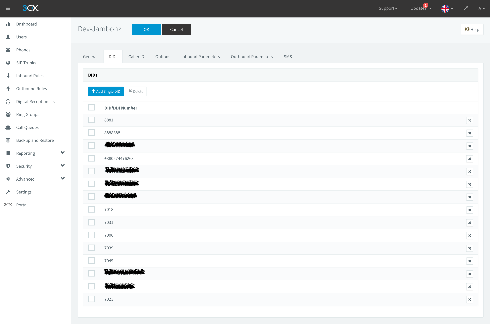
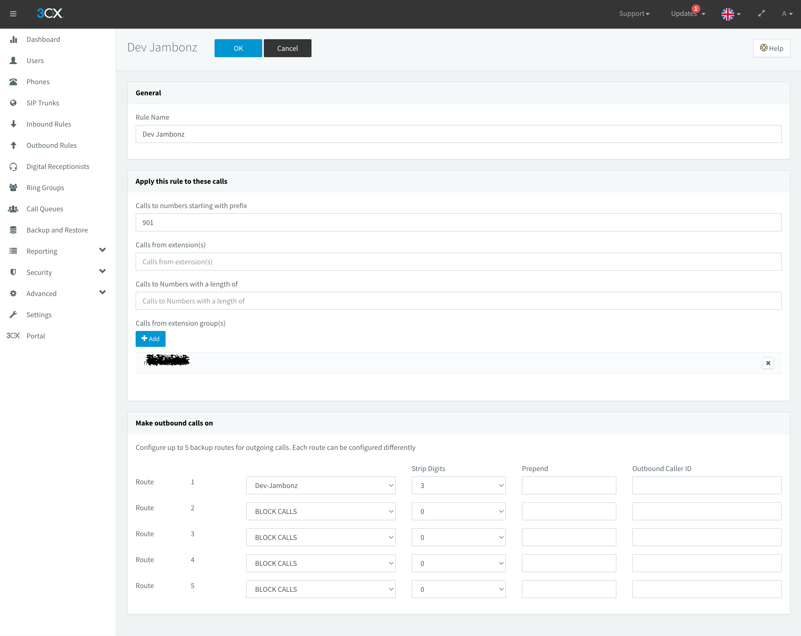
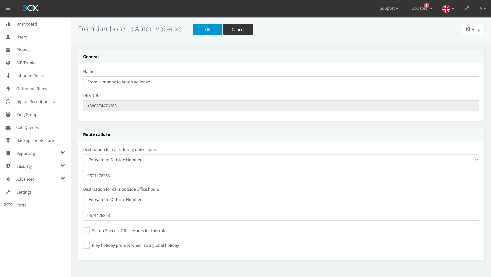
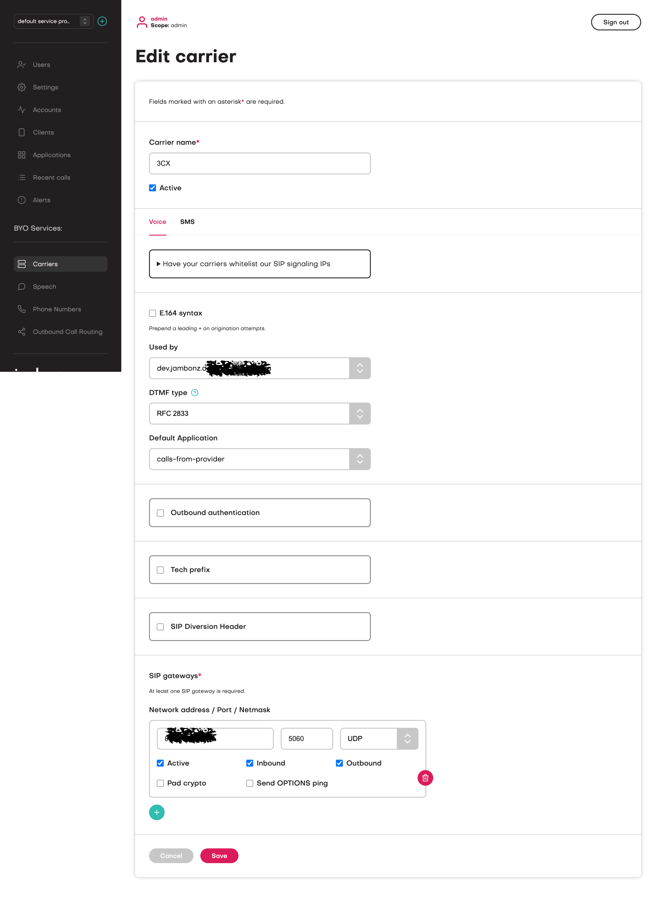

[3CX](https://www.3cx.com/) is a hosted PBX provider. You can connect your 3CX account 
to jambonz by creating a SIP trunk on 3CX and a Carrier on jambonz.

## 3CX configuration

### Create a SIP trunk
On the 3CX side, you will need to create a SIP trunk. As shown in the image below, 
you will first create the trunk, and then on the "General" tab, you will enter the 
sip domain of your jambonz account.  If you are using jambonz.cloud this will be your the 
sip subdomain you chose when you signed up for jambonz.cloud.  

If you are using a self-hosted jambonz platform, you can either enter 
the public IP of the jambonz SBC SIP server or, if you have assigned a subdomain for sip signaling 
you can use that.

You will enter this value in both the "Registrar.." and the "Outbound Proxy" fields as show below.

For the "Authentication" tab, use either IP-based authentication.

<Frame caption="">
  
</Frame>

Next, go to the Options tab and check to allow both inbound and outbound calls, disallowing 
video calls.  Also check "PBX delivers audio" under the "Advanced" section.

For codecs, make sure to select both G.711 ulaw and alaw.

<Frame caption="">
  
</Frame>

Now go to the DIDs tab and add the phone numbers that you will see on incoming calls from jambonz.

<Frame caption="">
  
</Frame>

Now that the SIP trunk is created, we need to instruct 3CX when to send calls out on this trunk, and 
how to handle incoming calls arriving on this trunk from jambonz.

### Create an outbound rule
First, create an outbound rule. In the example below, we are going to route any call that the PBX receives, which starts with 
901 to jambonz.

<Frame caption="">
  
</Frame>

### Create an inbound rule
Next, creat an inbound rule.  In the example below, we've created routing for incoming calls to a 
specific number such that they are forwarded on to a different outside number.

<Frame caption="">
  
</Frame>

## jambonz configuration
On the jambonz side, you will create a carrier to represent the 3CX SIP trunk.

Add a sip gateway for the carrier that you created and enter the IP address of the 3CX server. 
Check both the inbound and outbound boxes and save the carrier.

<Frame caption="">
  
</Frame>

Finally, add phone numbers in jambonz [as described here](/guides/using-the-jambonz-portal/basic-concepts/creating-phone-numbers) and set up the application 
routing that you need.

<Tip title="Shout out!" icon="party-horn">
Thanks to jambonz community member @AVoylenko for contributing this guide!
</Tip>

