This guide explains how to connect [Vonage](https://developer.vonage.com/en/sip/overview) as a SIP provider to jambonz.cloud.

## Vonage configuration

### Create a SIP trunk
Log into your [Vonage dashboard](https://dashboard.nexmo.com/sip-trunking) and select "SIP" under the "BUILD & MANAGE" section on the left-hand side.

1. Click the "Get started" button, which will open their setup wizard.
<Frame caption="">
  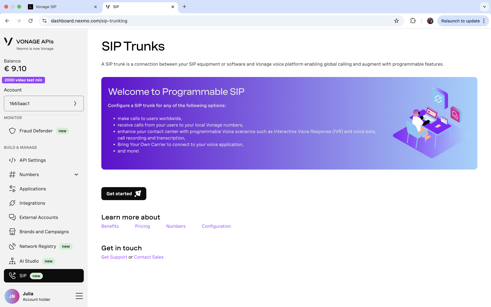
</Frame>

2. Select "Something else".

<Frame caption="">
  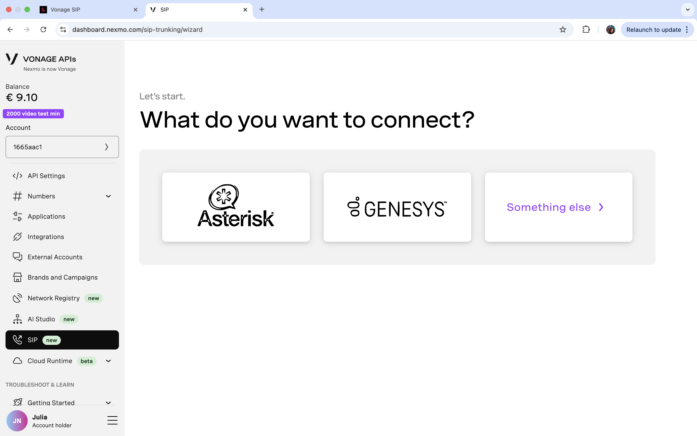
</Frame>

3. Vonage has now created a trunk for you. Make note of your domain name, user name, and password—we'll need these later to connect to jambonz.

<Frame caption="">
  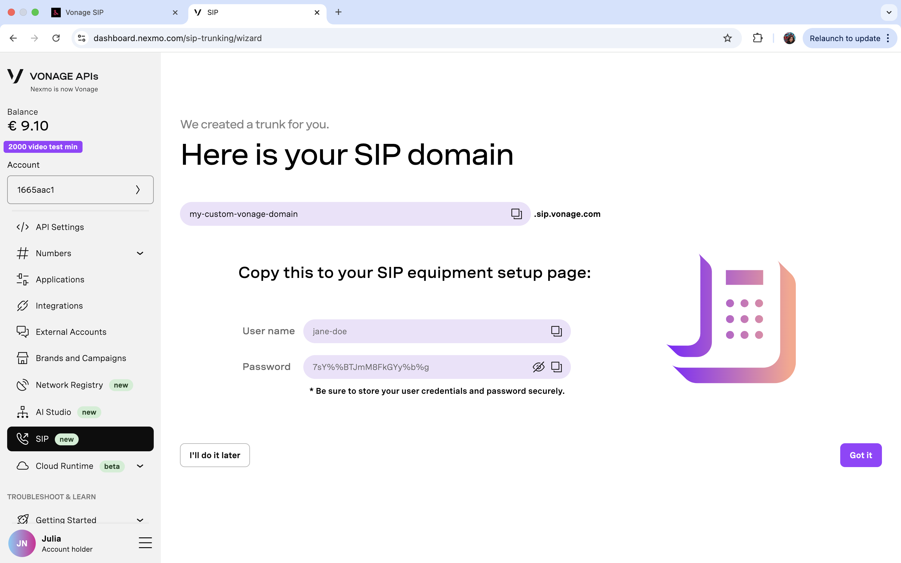
</Frame>
Click "Got it".

4. Next, you'll need to buy a [Vonage number](https://dashboard.nexmo.com/numbers/buy-numbers) if you haven't already. 
Select "SMS & VOICE" from the "Feature" drop-down, then search for a number of your liking from the available list. Confirm purchase by clicking "Buy".

<Frame caption="">
  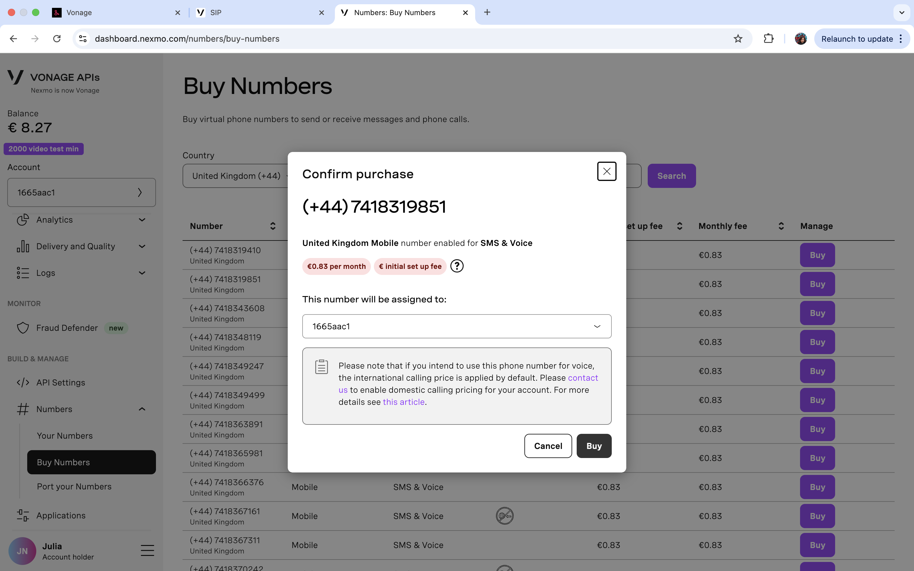
</Frame>

Coming back to the [wizard](https://dashboard.nexmo.com/sip-trunking/wizard), it will prompt you to make a call, but we can skip this step for now. Click "It works" to advance to the next step.

<Frame caption="">
  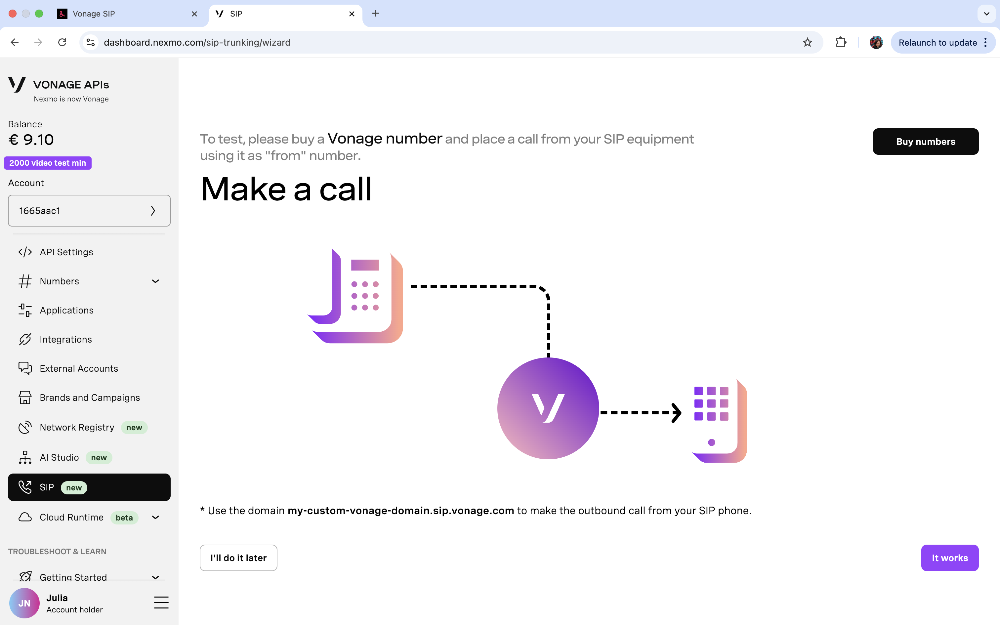
</Frame>

5. Next, fill in your jambonz SIP address. You can find this as "SIP realm" under "Accounts" in your [jambonz.cloud account](https://jambonz.cloud/internal/accounts/).

<Frame caption="">
  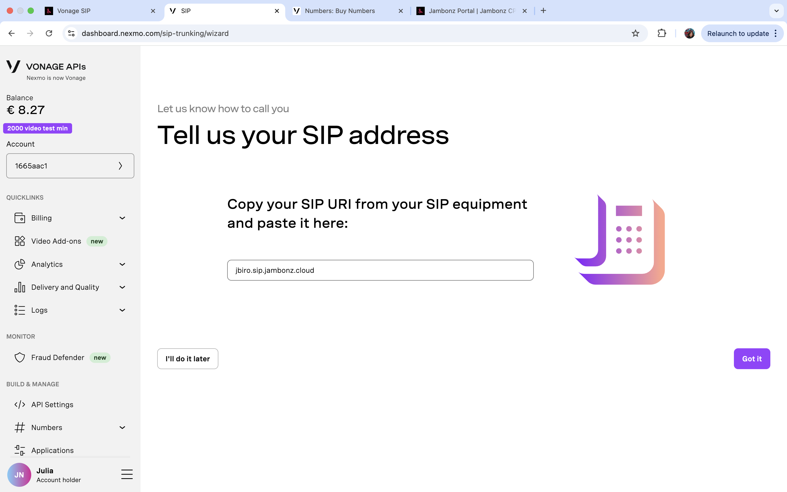
</Frame>

6. Now, select the phone number you just purchased or any other available number in your Vonage account. Click "This one".

<Frame caption="">
  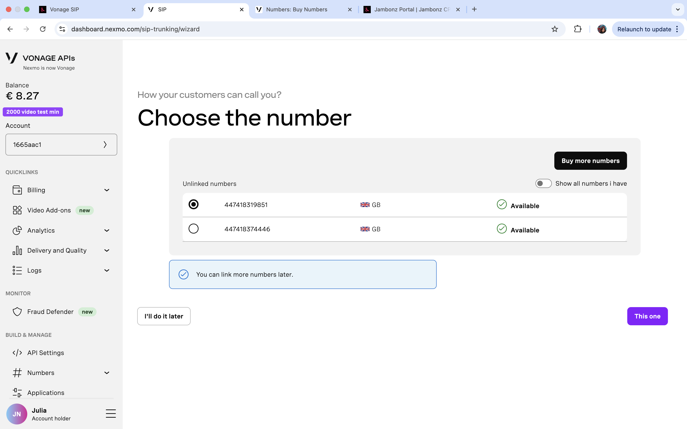
</Frame>

Once you reach the end of the wizard, it's time to configure the jambonz side.

## jambonz configuration

### Add a new carrier to represent your new Vonage SIP trunk
In your [jambonz.cloud](https://jambonz.cloud/internal/carriers) account, navigate to the "Carriers" page and click the "Add carrier" button or the "+" sign.

1. Give it a name under "Carrier name", for example "Vonage".

<Frame caption="">
  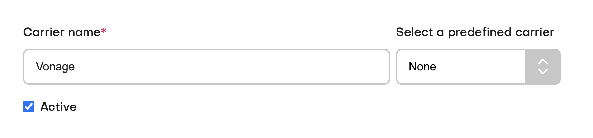
</Frame>

2. Check "E.164 syntax" and "Outbound authentication", then fill in your credentials from step 3 of the Vonage configuration section.

<Frame caption="">
  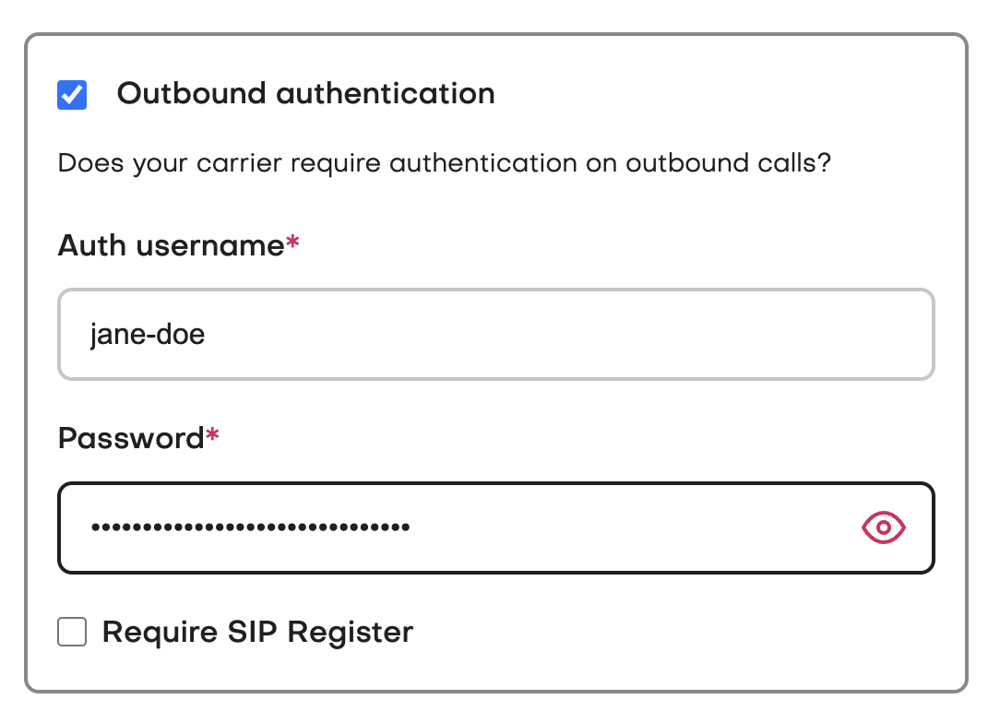
</Frame>

In case you've misplaced these credentials, head back to your Vonage dashboard and click on "Edit Authentication" in the "Outbound Calling" section of your SIP trunk config.

<Frame caption="">
  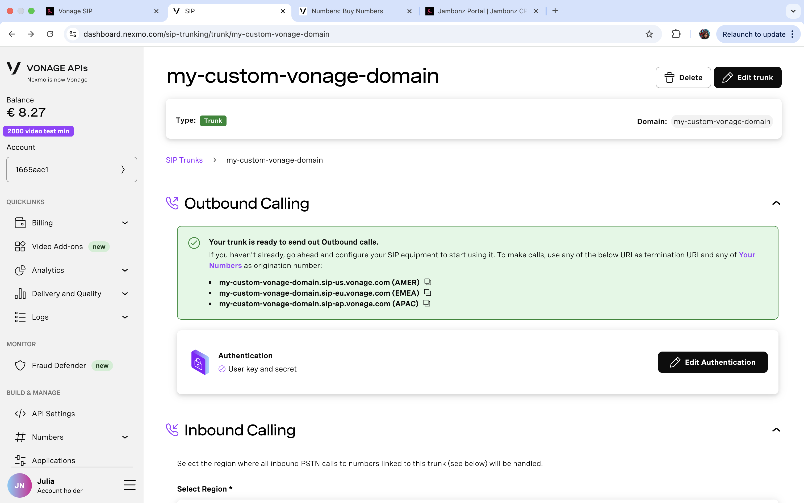
</Frame>

3. Add "SIP gateways".

You'll need to create inbound SIP gateways for traffic coming from [Vonage's IP addresses](https://api.support.vonage.com/hc/en-us/articles/360035471331-Which-IP-addresses-should-I-allow-when-using-Communication-APIs-and-SIP-Trunking).

It's recommended that you add the following IP addresses one by one. Choose port 5060 and netmask 32 in this case.
216.147.0.1
216.147.0.2
216.147.1.1
216.147.1.2
216.147.2.1
216.147.2.2
216.147.3.1
216.147.3.2
216.147.4.1
216.147.4.2
216.147.5.1
216.147.5.2

Alternatively, you can add their primary subnets: 216.147.0.0/18 and 168.100.64.0/18.

For the outbound gateway, add the Vonage domain you chose when creating your SIP trunk. For example, my-custom-vonage-domain.sip-us.vonage.com.

<Frame caption="">
  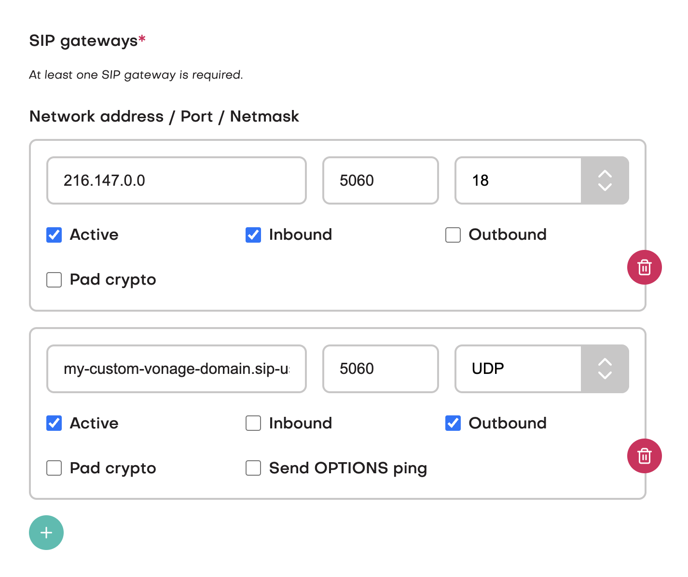
</Frame>

### Add phone number

Finally, add and configure your Vonage number(s) in the jambonz portal.
Navigate to "Phone Numbers" on the left-hand side and click the "Add phone number" button.

Paste in the Vonage number linked to your Vonage SIP trunk, using international format and only numberical charecters. For example, "447418319851".
Next, ensure your jambonz account is selected from the "Account" drop-down, select "Vonage" as the "Carrier", and select "hello world" as the linked "Application". This way you can test that you've set up everything successfully, then update the linked application later to the project of your choice.

<Frame caption="">
  
</Frame>

To finish, click "Save". Call the number you just added and test it out!