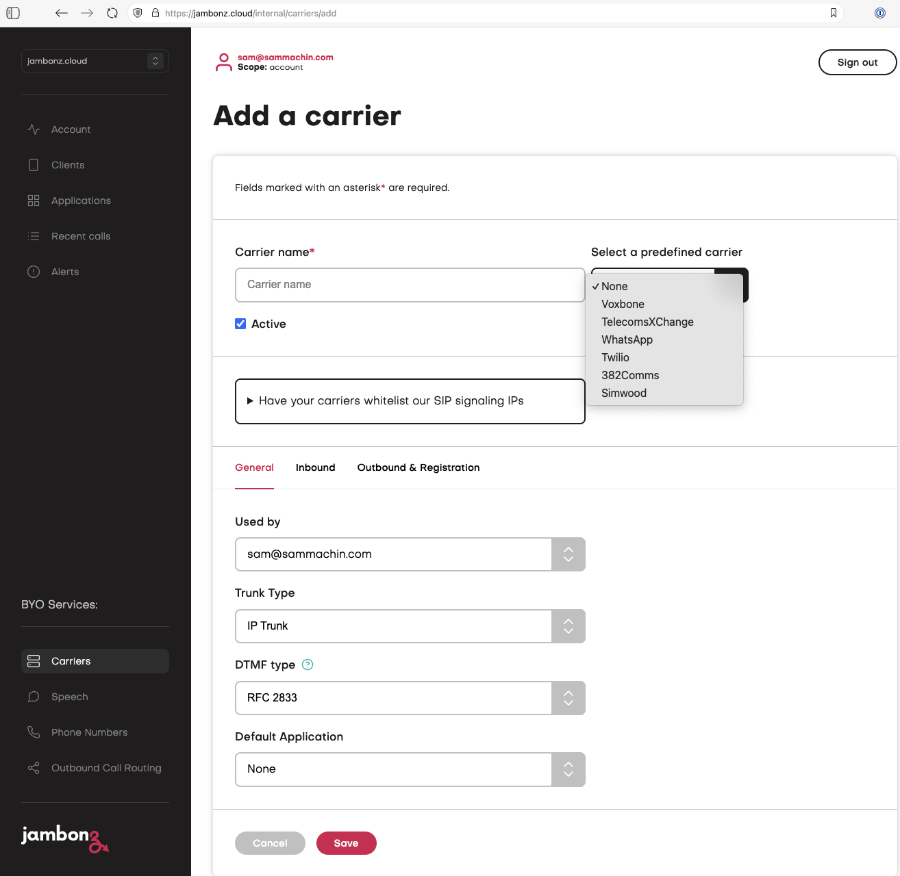
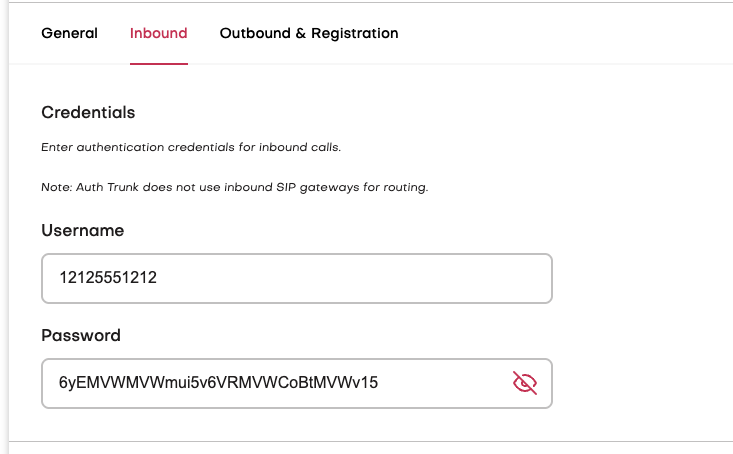
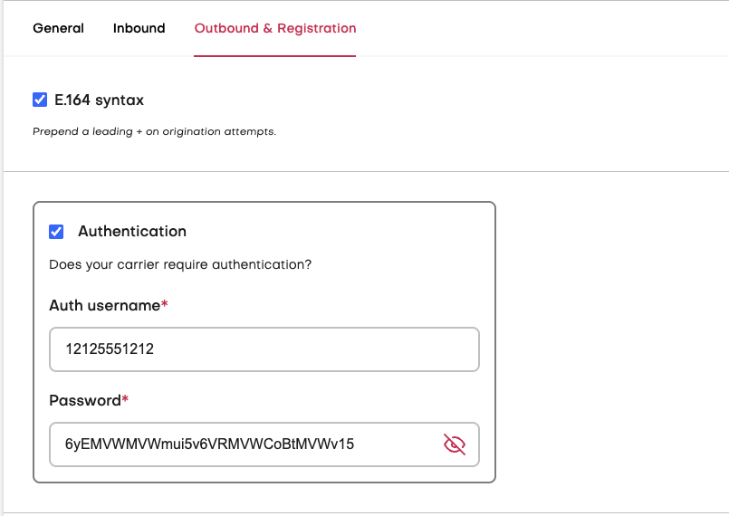
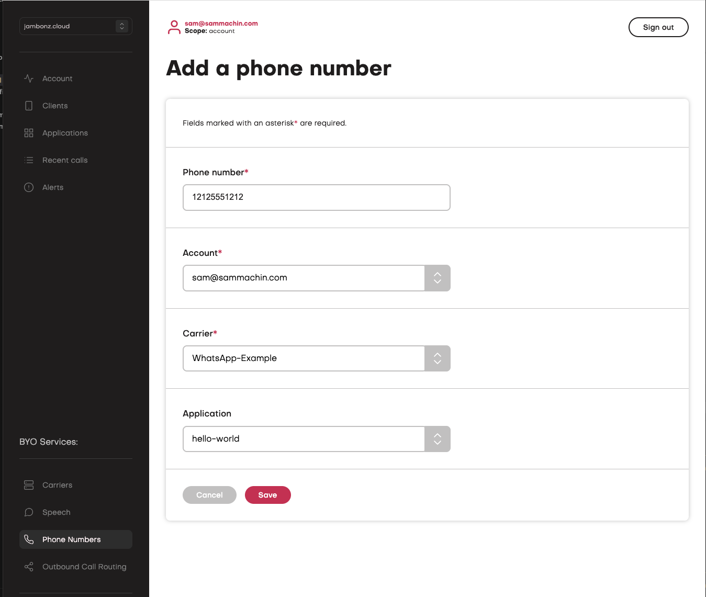

Jambonz now supports [WhatsApp Business Calling](https://developers.facebook.com/documentation/business-messaging/whatsapp/calling) 

## WhatsApp configuration
Consult the WhatsApp documentation for how to get your WhatsApp business number enabled for calling, 
note there are certain restrictions on making outbound calls to WhatsApp users, generally they need to give you permission to call them.

We use the SIP integration from WhatsApp (not the graph API) and we recommend using SDES as the media transport instead of ICE/DTLS.

In order to setup your WhatsApp number for SIP  you will need to make an API call to WhatsApp to set the server HOSTNAME and PORT.
https://developers.facebook.com/documentation/business-messaging/whatsapp/calling/sip#configureupdate-sip-settings-on-business-phone-number

The hostname will need to be your Jambonz sip subdomain found on your account page in the format of `accountname.sip.jambonz.cloud`
The port is `5061`

Once you have configured this on the WhatsApp API you should then be able to get your SIP_USER_PASSWORD from
https://developers.facebook.com/documentation/business-messaging/whatsapp/calling/sip#include-sip-user-password

<Note>
Our friends at [NimbleApe](https://nimblea.pe) have written a [bash script](https://github.com/nimbleape/whatsapp-business-sip-setup/tree/main) to help with this setup 
</Note>

## jambonz configuration

On jambonz we have added WhatsApp as a pre-defined carrier that will create a new Carrier in your account from our template.
 
On the Add a carrier screen just select WhatsApp from the dropdown at the top.
<Frame caption="">
  
</Frame>
<Note>
You may want to give this carrier a more friendly name than the random string that is generated for you.
</Note>

Now on the `Inbound` section at the bottom edit the Username to be your WhatsApp Business number without the + symbol eg 12125551212, and in the Password field enter the SIP_USER_PASSWORD you got from the WhatsApp API.
<Frame caption="">
  
</Frame>

Next on the `Outbound` section add these same values to the Authentication section.
<Frame caption="">
  
</Frame>

Thats all the carrier settings, you can leave the rest as they are set, Click the Save button

### Add phone number

Finally, add and configure your WhatsApp number in the jambonz portal.
Navigate to "Phone Numbers" on the left-hand side and click the "Add phone number" button.

Paste in the WhatsApp number linked to your Vonage SIP trunk, using international format and only numerical characters. For example, "12125551212".
Next, ensure your jambonz account is selected from the "Account" drop-down, select "Vonage" as the "Carrier", and select "hello world" as the linked "Application". This way you can test that you've set up everything successfully, then update the linked application later to the project of your choice.

<Frame caption="">
  
</Frame>

To finish, click "Save". Call the number from WhatsApp and you should hear the Hello World greeting.

## Note about Outbound calling.

When making an Outbound call from jambonz to WhatsApp you need to specify an additional header in the [Dial](https://docs.jambonz.org/verbs/verbs/dial) verb or the [Create Call](https://docs.jambonz.org/reference/rest-call-control/calls/create-call#request.body.headers) method.

This header is `X-Preferred-From-Host` and the value should be your jambonz sip domain eg `accountname.sip.jambonz.cloud` This is required otherwise WhatsApp rejects the call.