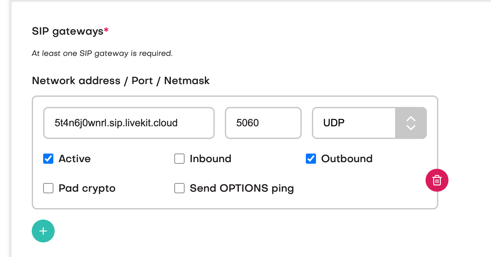
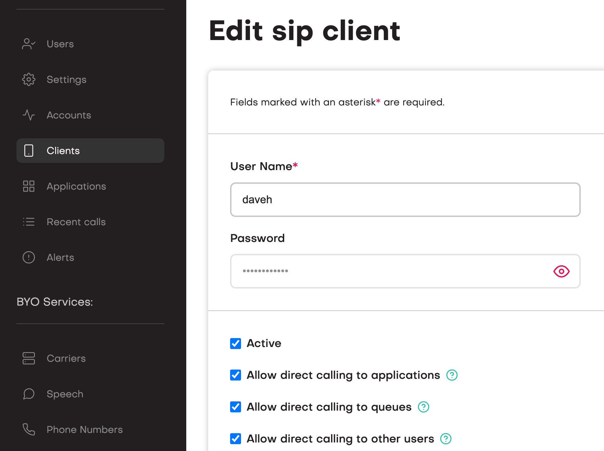
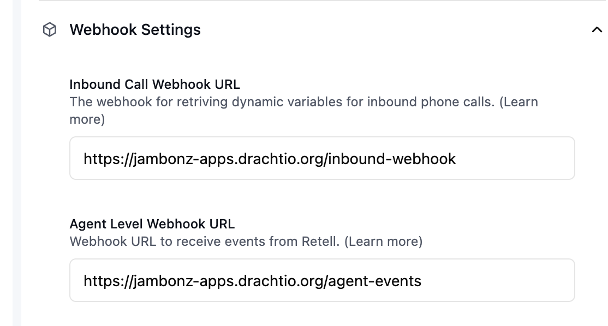

<Note>
The jambonz application referenced in this article can be 
found [here](https://github.com/jambonz/retell-sip-integration-example). 
You can deploy this application to your Heroku account with just a few clicks. 
[](https://www.heroku.com/deploy?template=https://github.com/jambonz/retell-sip-integration-example)
</Note>

## Installing

Having checked out this repo, do the usual:
```bash
npm ci
```

## Provisioning jambonz

### Add a carrier for Retell

<Note>
You may wish to review [this article](/guides/using-the-jambonz-portal/basic-concepts/creating-carriers) 
before continuing in order to learn the basics about provisioning a carrier in the jambonz portal.
</Note>

First, create a Carrier named 'Retell' in jambonz. 
This carrier will have one outbound gateway and no inbound gateways.
Check the box for E.164 syntax, uncheck outbound authentication, and then add one outbound SIP gateway 
with the network address of `5t4n6j0wnrl.sip.livekit.cloud`.

<Frame caption="Provisioning carrier for Retell">
  
</Frame>

### Add a carrier for your SIP trunking provider

Next, add a second Carrier for your SIP trunking provider. 
This carrier should have both inbound gateways and outbound gateways. 
Your SIP trunking provider should be able to provide you either with the static 
IP addresses that they will be sending you traffic from, or a sip username and password to 
authenticate with. 

### Create a sip credential

Next, add a SIP client credential. 
Click on "Clients" and add a sip client with a name and password.

<Frame caption="Creating a sip credential">
  
</Frame>

### Create a jambonz application

Create a new application in jambonz, providing the websocket URL of your application for the 
calling webhook field as well as the call status field.  Leave all other fields at their default settings.

### Add a phone number

Your sip trunking provider should have provided you with one or more phone numbers that will be routed 
to your jambonz account.  In the jambonz portal, 
[add a phone number](/guides/using-the-jambonz-portal/basic-concepts/creating-phone-numbers) and 
route incoming calls on these numbers to your application.

### Route sip device calls to your application

Finally, on the Accounts page, set the dropdown for `Application for SIP device calls` to the 
application you created above.

#### Configuring Retell

Retell calls an inbound call webhook to get dynamic variables for incoming calls, and  
this application provides a endpoint for that at  
[/inbound-webhook.js](https://github.com/jambonz/retell-sip-integration-example/blob/main/lib/webhooks/endpoints/inbound-webhook.js), 
so log into the Retell console and add this webhook.

<Frame caption="Retell webhook">
  
</Frame>

<Note>change the DNS name to that of your websocket server</Note>

You'll note that this application also provides a webhook to receive agent events from Retell. 
Currently [these are simply logged](https://github.com/jambonz/retell-sip-integration-example/blob/main/lib/webhooks/endpoints/agent-events.js) for informational purposes, 
but you may want to use this information in your application.

Finally, you need to add the phone number that you are receiving calls on from your 
SIP trunking/DID provider in the Retell console. 
In the Retell Dashboard, select "Phone Numbers" and click the plus sign. 
In the dropdown select "Connect to your number via SIP trunking".

- Add the phone number in E.164 format (ie leading + followed by country code)
- For termination URI enter a URI with the 'sip' scheme and the DNS of your sip realm in jambonz (you can find that under the Account tab), e.g. 'sip:mydomain.sip.jambonz.cloud'
- For sip trunk username and password enter the username and password you created above on jambonz.

After creating the phone number, associate it with the Retell agent you want to use.

### Running the application

#### environment variables

You must set the following environment variables when running the application:

- `RETELL_API_KEY` - the API key for your Retell account
- `RETELL_TRUNK_NAME` - the name of the Carrier you created for Retell in jambonz
- `PSTN_TRUNK_NAME` - the name of the Carrier you created for your SIP trunking provider in jambonz
- `RETELL_SIP_CLIENT_USERNAME` - the username of the SIP client you created in jambonz

```bash
RETELL_API_KEY=xxxxxxxxxx \
RETELL_TRUNK_NAME=Retell \
PSTN_TRUNK_NAME=myCarrier \
RETELL_SIP_CLIENT_USERNAME=retell \
node app.js
```

Now, when an incoming call arrives from Retell it will be sent out your PSTN provider. 
Conversely, when an incoming call arrives from the PSTN it will be connected to Retell.

For a detailed explanation of how this works, please watch this [video](https://youtu.be/PH2amb0PIhE).
