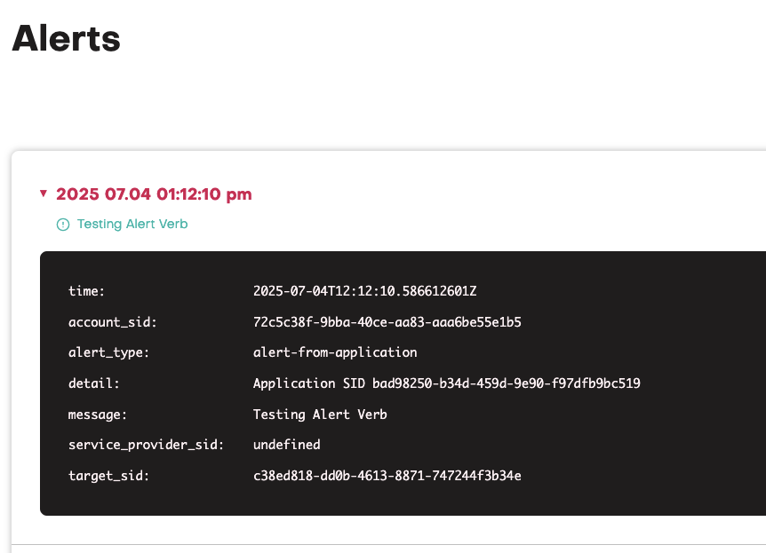

The purpose of this verb is to allow applications to raise alerts in the jambonz platform 
```json
{
  "verb": "alert",
  "message": "Testing Alert Verb"
}
```

The alert in the UI will contain the Application SID in the detail and the message will be displayed, these alerts will be availble via the API.

Example of the alert displayed as:
<Frame>
  
</Frame>


## Parameters

<ParamField path="message" type="string" required={true}>
  Message to be displayed in the alert.
</ParamField>

